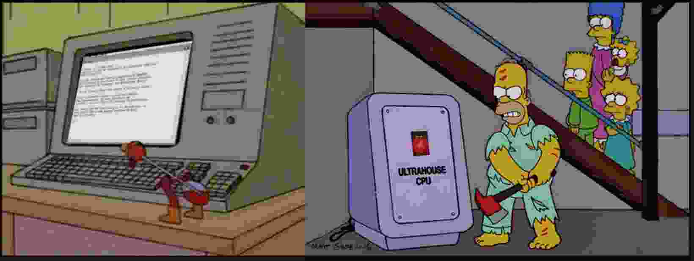

# Introducción {#sec-index .unnumbered}



👋 ¡Hola! En esta guía pueden encontrar una lista de recursos útiles y recientes sobre el uso de modelos de lenguaje de gran tamaño (LLM por sus siglas en inglés), con un enfoque en R.

Con fines docentes y para ayudarme a estar al tanto de lo más nuevo, convertí una publicación en mi blog de finales de 2024 en este formato de libro que creo que es más fácil de navegar. Voy a estar actualizando el contenido periódicamente: cuando salgan nuevas herramientas y/o conforme me vaya enterando de ellas.

El campo del uso de inteligencia artificial (IA) en R avanza rápidamente, por lo que los proveedores, los nombres de software, las API y las funciones generales están sujetos a cambios. Haré lo posible para mantener esta guía actualizada y mencionar los cambios y novedadess.

> Hay varios términos en este campo que seguramente no están bien traducidos en esta guía. 

Los logotipos de abajo enlazan a los sitios oficiales de cada paquete o herramienta.

```{r}
#| warning: true  # Add this
#| echo: false
#| error: true    # Add this
#| message: true  # Add this

logos <- fs::dir_ls(here::here("images/hex/"))

urlss <- c(
  "https://codeium.com/",
  "https://knowusuboaky.github.io/LLMAgentR/",
  "https://posit-dev.github.io/acquaint/",
  "https://github.com/heurekalabsco/axolotr",
  "https://posit-dev.github.io/btw/",
  "https://simonpcouch.github.io/buggy/",
  "https://knowusuboaky.github.io/chatLLM/",
  "https://mlverse.github.io/chattr/",
  "https://simonpcouch.github.io/chores/",
  "https://www.continue.dev/",
  "https://github.com/features/copilot",
  "http://elmer.tidyverse.org/",
  "https://jhk0530.github.io/gemini.R/",
  "https://github.com/frankiethull/ggpal2",
  "https://michelnivard.github.io/gptstudio/",
  "https://gabrielkaiserqfin.github.io/groqR",
  "https://dylanpieper.github.io/hellmer/",
  "https://github.com/frankiethull/kuzco",
  "https://github.com/simonpcouch/gander/",
  "https://mlverse.github.io/mall/",
  "https://mlverse.github.io/lang/",
  "https://hauselin.github.io/ollama-r/",
  "https://docs.ropensci.org/pangoling/",
  "https://github.com/GabrielKaiserQFin/PerplexR/",
  "https://tidyverse.github.io/ragnar/",
  "https://www.ekotov.pro/rdocdump/",
  "https://jbgruber.github.io/rollama/",
  "https://r-pkg.thecoatlessprofessor.com/searcher/",
  "https://tidychatmodels.albert-rapp.de/",
  "https://edubruell.github.io/tidyllm/",
  "https://vitals.tidyverse.org/"
)

names(logos) <- urlss
samplelogos <- sample(logos)

hexsession::make_tile(local_images = samplelogos, local_urls = names(samplelogos), dark_mode = F)

```

Cualquier sugerencia o solicitud es bienvenida, ya sea a traves del codigo fuente de esta guía en ([GitHub](https://github.com/luisdva/llmsr-book/)) o contactactándome por cualquier medio.

## Sobre mí

Soy macroecólogo, mastozóologo, y trabajo en ciencia de datos de biodiversidad. Visita mi [página personal](https://liomys.mx) para más contenido y detalles.

