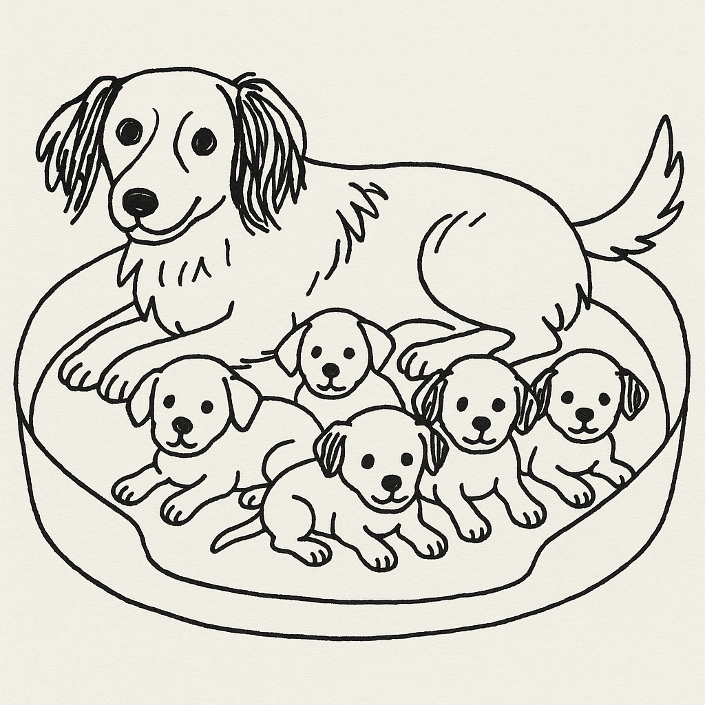

```{r fa packages setup}
#| echo: false
library(fontawesome)
```

## Hello!

:::::: columns
::: {.column width="30%"}
{width="80%"}\
[`r fontawesome::fa(name = "mastodon")` \@LuisDVerde](https://fosstodon.org/@LuisDVerde)\
[`r fontawesome::fa(name = "github")` \@LuisDVA](https://github.com/luisdva)\
[`r fontawesome::fa(name = "link")` liomys.mx](https://liomys.mx)\
[`r fontawesome::fa(name = "paper-plane")` luis\@liomys.mx](mailto:luis@liomys.mx)
:::

:::: {.column width="70%"}
::: smaller-font
-   Mammals, macroecology, conservation
-   R user since 2011 / 'blogger' since 2015
-   Certified Instructor - Posit(RStudio) & The Carpentries\
-   Online and in-person courses all year (Physalia Courses Online, R for the Rest of Us)
-   rOpenSci mentor 2023-2026
-   Package developer
-   R conference speaker + organizer
-   R-Ladies collaborator (St. Louis 🇺🇸; Buenos Aires 🇦🇷; Gaborone 😃 🇧🇼)
:::
::::
::::::

## 

Language Models?

. . .

**Large** Language Models?

. . .

Generative AI?

## 

<br/><br/>

:::::: columns
::: {.column width="30%"}

:::

:::: {.column width="70%"}
::: large-font-slide
After drinking some water, the dog went back to the bed to feed her \_\_\_\_\_\_\_\_\_\_\_.
:::
::::
::::::

. . .

`puppies: 0.12, babies: 0.10, family: 0.07, offspring 0.042, kittens 0.02 etc.`

## 

### Language models

Predict and generate text by estimating the probability of tokens occurring in a given sequence.

<br/>

### *Large* language models

Add more parameters and massive datasets, enabling more complex tasks

<br/>

#### Transformers

A novel (2017) algorithmic architecture to help models focus on important parts of their input for more efficiency

## LLMs can help us with:

Text generation, translation, sentiment analysis, writing and debugging code, generating images and videos, etc.

# However

## Let's consider:

-   Growing evidence of negative effects on learning
-   Biases
-   Hype
-   Valid anti-AI sentiment
-   Issues with training material (piracy, fair use considerations, copyright)
-   Provider intentions

## 🚫 Hype 🚫

(hint: disregard the hype and use what makes you more efficient)

::::: columns
::: {.column width="40%"}

:::

::: {.column width="60%"}
"If you don't become an AI/prompt engineer by tomorrow you're a loser with no future"

<br/> "Your product needs AI or it will be worthless"

<br/> "All your training in data and coding was a waste of time"
:::
:::::

## Still...

> I believe everyone deserves the ability to automate tedious tasks in their lives with computers - Simon Willison

> ..providing a way for people to talk with machines in plain language constitutes a dramatic step forward in making computing accessible to everyone - Carl Bergstrom (paraphrased)

## Where are the models? Who makes them?

Many popular LLMs are hosted by cloud providers

-   [OpenAI](https://openai.com/) (Known for GPT series including ChatGPT)
-   [Google AI](https://ai.google.dev/) (Gemini models)
-   [Anthropic](https://www.anthropic.com/) (Claude models)

<br/> Many more! ([let's have a look](https://docs.continue.dev/customize/model-providers))

## Cloud-Hosted models

:::::: columns
::: {.column width="43%"}
-   Relatively easy setup
    -   Create account, set up billing if applicable, get an API key
-   Access to new and in-development models and massive computing power
:::

::: {.column width="4%"}
:::

::: {.column width="43%"}
-   Can be costly

-   Need internet access

-   We send our data to the API
:::
::::::

## Local models

Download smaller models on our own hardware

:::::: columns
::: {.column width="43%"}
-   Data not shared with a provider
-   No ongoing costs
-   Work offline
:::

::: {.column width="4%"}
:::

::: {.column width="43%"}
-   Steep learning curve
-   Large memory requirements
-   Slower performance
:::
::::::

<br/>

#### Examples:

[`Ollama`](https://ollama.com/) (Simplifies running open-source LLMs locally)\
[Hugging Face `transformers`](https://huggingface.co/docs/transformers/index) (lots of open-source models)

## Which model do I use?

### Considerations

-   Pricing
    -   Free tiers, price per token, billing policies
-   Speed
-   Privacy
-   Hardware

## On pricing

> Nothing is more costly than something given free of charge\
> - Japanese proverb.

. . .

-   nothing is offered for free unless there is something to be gained for the party involved

-   if we are not paying for the product, then **we** are the product

## Interacting with LLMs

<br/>

### In the browser

Web-based chat interfaces, often with conversation histories and file upload features.

<br/>

### Programatically through an API

Application Programming Interfaces (*APIs*) are the rules and protocols that determine how one application can request data from another.

## APIs

::::: columns
::: {.column width="40%"}

:::

::: {.column width="60%"}
Let different software systems talk to each other and exchange data without having to understand each others' inner workings.
:::
:::::

## APIs

Allow your applications (R scripts, browser-based prompts, mobile apps) to:

```         
-   Send input text (prompts)
-   Specify which LLM model to use 
-   Receive generated text, code, or structured data back
-   Handle authentication (e.g., using API keys)
```

## API Keys

Working with APIs means we need to identify ourselves to the model provider and authenticate our encrypted connection to their servers

</br>

#### Overall workflow

-   Create and account with a model provider
-   Generate an API key
-   Keep it safe but reachable by your LLM tools

## 

<br/>

> In R most of the relevant packages can work with keys stored in Environment Variables.

-   Never share your API keys in public repositories or documents

H. Wickham - [Managing secrets](https://cran.r-project.org/web/packages/httr/vignettes/secrets.html)

Ted Laderas - [A gRadual introduction to web APIs and JSON](https://www.youtube.com/watch?v=HA7KfdEsdpo)

## Why LLMs + R


## 

### Decent enough outputs

-   Working code, actual problems solved

### Explosion of programs and features in late 2024

-   Relevant keynotes, blog posts, demos

### Reduce **context switching**

Shifting our attention between different tasks or programs can be tiring and make us less productive and efficient.

Browser ↩️↪️ IDE ↩️↪️ Word Processor ↩️↪️ Cellphone

Lots of copying and pasting may introduce errors.

## Why the LLMs + R guide?

-   Learn about Quarto books

-   Show off 📦 `hexsession`

-   Contribute in Spanish to improve access to these tools

-   Keep up with developments and learn to use the tools I include

# Getting started

## Questions we might put in an LLM chat window?

::: retro-console-window
\> How do I add a subtitle to my ggplot figure?\
\> What are the arguments for pivot_wider()?\
\> I can't join my table_1 object with my dat3 data frame, help!
:::

## LLMS in R

Trying to help someone over the phone vs. helping someone at the computer


# Three quick demos

## 'Continue' extension

> "an open-source AI code assistant"

-   runs as an extension in VS Code (and OSS Code forks including Positron) and JetBrains

Cool IDE features:

-   Chat
-   Autocomplete
-   Context Items

## `ellmer` and friends

{width="26%"}

### Bridging R and LLMs

-   Robust and designed specifically for easy interaction with LLMs directly from R

-   Broad provider support and meant for entreprise/production use

-   Allows models to extend their capabilities by executing R code

-   Can produce output that is immediately usable in R

## `ellmer` demos

-   `chatGroqDemo.R`

-   `extractPDFdemo.R`

## `gander`

::::: columns
::: {.column width="50%"}

:::

::: {.column width="50%"}
-   More than a simple chat window
-   Powered by `ellmer`
:::
:::::

gander receives a snapshot of our environment with every request and recognizes what we are talking about, including object and variable names

`ganderDemo.R`

## Not part of this talk but interesting

(and somewhat covered in the Quarto Guide)

-   Model Context Protocol (MCP): the "USB-C port for AI applications"

-   Resource Augmented Generation (RAG): enhance the accuracy and reliability of LLMs with additional information from relevant data sources.

-   AI agents: Leverage MCP to do many things in with some degree of 'autonomy'

## Staying Up-to-Date

-   Very dynamic and fast-moving field
-   Key players are constantly innovating and collaborating\
-   Conferences often introduce novel tools
-   Blogs and social media

## Closing thoughts

-   LLM-based tools are not always necessary. The answers you need may already be in the documentation, a book, your colleagues, a blog or tutorial, etc.

<br/>

-   Use for efficiency but always verify outputs

</br>

-   Experiment and share your successes!

## Acknowledgements

Team at posit making, maintaining, and improving several of these tools: Simon Couch, Garrick Aden-Buie, Hadley Wickham, Joe Cheng, Tomasz Kalinowski, Winston Chang, and many others.

MLverse team.

Albert Rapp and Chris Brown for sharing tutorials early in the life cycles of many of these tools.

Other developers and Maintainers: Frank Hull, Gabriel Kaiser

Everyone that shares, gives me feedback on the guide, or points me to need tools I missed.

. . .

🤔🤔🤔

# Thanks!

(these slides will be linked in the LLMs Guide by Monday)

::::: columns
::: {.column width="50%"}
[`r fontawesome::fa(name = "mastodon")` \@LuisDVerde](https://fosstodon.org/@LuisDVerde)\
[`r fontawesome::fa(name = "github")` \@LuisDVA](https://github.com/luisdva)\
[`r fontawesome::fa(name = "link")` liomys.mx](https://liomys.mx)\
[`r fontawesome::fa(name = "paper-plane")` luis\@liomys.mx](mailto:luis@liomys.mx)
:::

::: {.column width="50%"}
{fig-align="right" width="50%"}
:::
:::::
