# Paquetes de R {#sec-r-pkgs}

Esta sección incluye paquetes de R que se conectan con APIs de LLM o proporcionan ayudantes, chats o complementos relevantes.

Los paquetes están resumidos aquí sin ningún orden en particular, pero los junté en categorías generales:

## Interfaces generales

### [axolotr](https://github.com/heurekalabsco/axolotr)
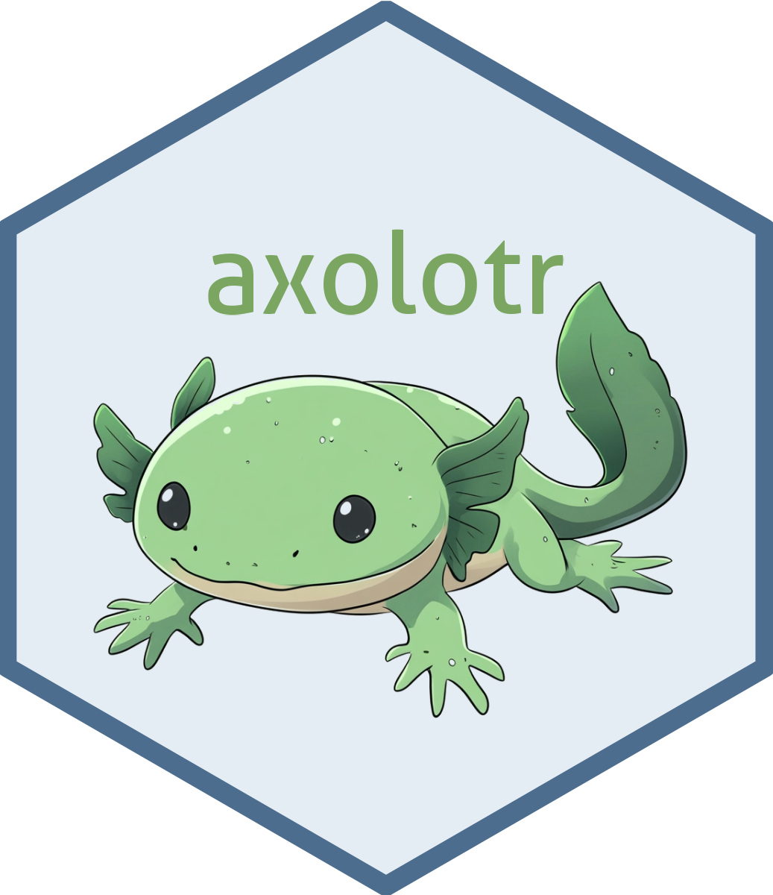

axolotor por Matthew Hirschey y Pol Castellano Escuder es otro paquete que nos brinda una interfaz generalizada para interactuar con APIs de distintos proveedores de LLMs. El paquete tiene funciones para aprovechar herramientas que son específicas a cada proveedor o modelo. También funciona con modelos locales y con la modalidad de 'thinking' de Claude 3.7 Sonnet. Funciona con una familia de funciones `ask()` y me gustó su logotipo.


### [chatgpt](https://github.com/jcrodriguez1989/chatgpt)

El paquete chatgpt nos permite interactuar con modelos de OpenAI para obtener ayuda mientras programamos. El paquete fue desarrollado por [Juan Cruz Rodriguez](https://jcrodriguez.rbind.io/), entonces seguramente es robusto y bien diseñado, pues he trabajado con Juan en el pasado en mejoras para annotater. Este paquete ha estado disponible por un buen tiempo ya y de hecho antecede a la mayoría de las herramientas LLM existentes para R, lo que demuestra la visión y las ideas novedosas de Juan.

Después de configurar una clave de API, podemos trabajar con addins de RStudio pre-programados para hacer cosas útiles como optimizar, comentar, explicar, seleccionar o probar código (entre otras). Funciona con selecciones o archivos completos y el modelo predeterminado es gpt-4o-mini.

### [groqR](https://gabrielkaiserqfin.github.io/groqR)

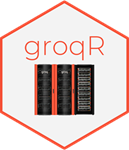

groqR por Gabriel Kaiser es una interfaz de R para modelos proporcionados por [GroqCloud](https://groq.com/). Existe una opción de cuenta gratuita disponible en groQ que nos permite generar una clave de API. El paquete tiene una aplicación de Shiny para configurar los parámetros relevantes y la clave de API. Me gustó que hay muchos modelos nuevos e interesantes para elegir, y las respuestas del LLM son **suuuuper rápidas**.

groqR llegó a mi atención gracias a su propio desarrollador, entonces le pedí una breve descripción para esta guía. En palabras de Gabriel (traducidas del inglés):

> "groqR es tu compañero de programación en R impulsado por IA, 10 veces más rápido que los LLM convencionales, con la mayoría de los modelos disponibles de forma gratuita. Ejecuta funciones en selecciones de texto: simplemente llama a la función `rewriter()` después de copiar texto para obtener resultados directamente en tu Consola R y portapapeles. Al combinar la velocidad de Groq con el acceso basado en atajos a las funciones de `groqR`, los usuarios logran el entorno de codificación más rápido y eficiente en el ecosistema R. Impulsado por el modelo líder actual [Qwen QwQ 32B](https://groq.com/a-guide-to-reasoning-with-qwen-qwq-32b/), GroqR garantiza un rendimiento de vanguardia"

### [gptstudio](https://michelnivard.github.io/gptstudio/)

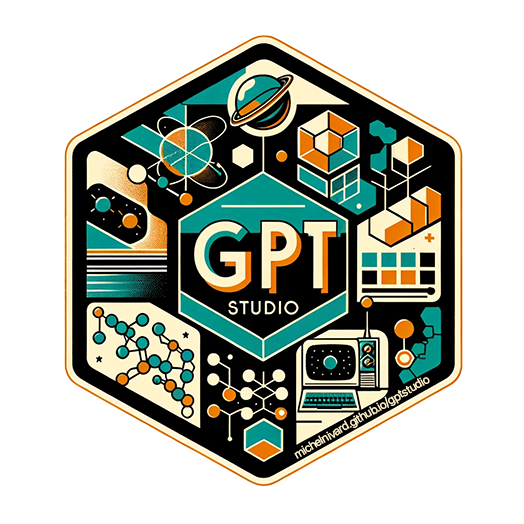

gptstudio de Michel Nivard, James Wade y Samuel Calderon es otra buena opción para acceder a LLMs localmente o desde varios proveedores (OpenAI, HuggingFace, Google, Anthropic, Perplexity, Azure y Cohere) directamente dentro de RStudio.

gptstudio funciona principalmente a través de una aplicación Shiny que se ejecuta en el panel de visualización y proporciona una ventana de chat y opciones para editar código en el editor. Tuve algunos problemas para hacer funcionar la aplicación en Linux, pero los desarrolladores parecen estar al [pendiente](https://github.com/MichelNivard/gptstudio/issues/179).

Me gustaron las advertencias que incluyen los autores en el README sobre la privacidad, seguridad y en general sobre no compartir datos sensibles con los proveedores de modelos.

### [llmR](https://github.com/bakaburg1/llmR)

llmr de Angelo D'Ambrosio proporciona una API unificada para interactuar con varios LLMs y proveedores a través de funciones con gramática y sintaxis consistentes. Permite cambiar fácilmente entre modelos. 

- Un paquete similar llamado [LLMR](https://cran.r-project.org/package=LLMR) apareció recientemente en CRAN, pero no pude encontrar mucha información al respecto.

### [tidychatmodels](https://tidychatmodels.albert-rapp.de/)

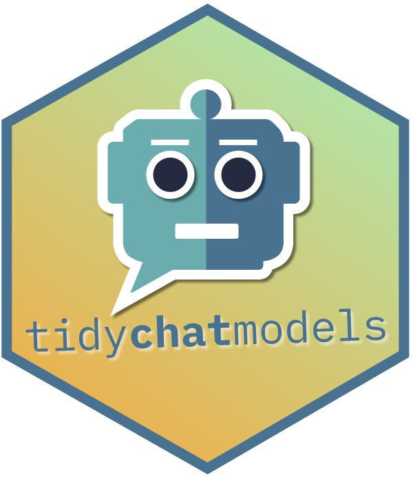

Una interfaz amigable con el estilo "pipe" para muchos proveedores de chatbots. Desarrollado por Albert Rapp, tidychatmodels sigue la naturaleza modular de tidymodels y usa httr2 para comunicarse con diferentes modelos. Buena documentación, ejemplos y un video tutorial claro en YouTube.

### [tidyllm](https://edubruell.github.io/tidyllm/)

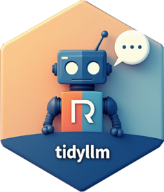

tidyllm de Eduard Brüll proporciona acceso amigable con el estilo "pipe" a múltiples APIs de LLM de una manera legible y amigable. Podemos pasar imágenes, documentos, videos y figuras que están el panel de gráficos a las funciones del paquete, y el paquete tiene una documentación muy completa. Se ve similar a ellmer, y tiene potencial para trabajo interactivo y para procesamiento por lotes. 

### [gemini.R](https://jhk0530.github.io/gemini.R/)

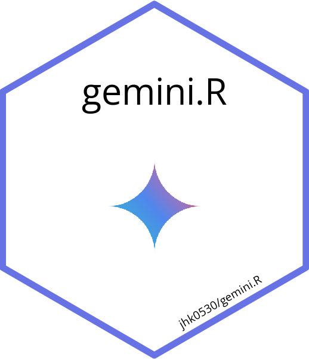

El paquete gemini.R de Jinhwan Kim conecta R con el modelo Gemini de Google a través de la API de Gemini. Con una clave API válida, la función `gemini()` admite indicaciones de texto, y la función `gemini_image()` puede trabajar con imágenes.

El paquete también tiene un addin de RStudio para crear documentación en Roxygen, y lo probé hace poco con el modelo Gemini Flash 2 para extraer información de un documento escaneado y funcionó bien.

### [PerplexR](https://github.com/GabrielKaiserQFin/PerplexR/)
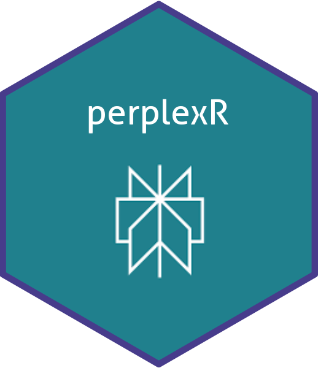

PerplexR de [Gabriel Kaiser](https://gabrielkaiserqfin.github.io/) proporciona una interfaz al estilo de groqR pero para los modelos sonar de Perplexity. Hace falta tener un plan de pago para generar la clave de API necesaria, así que todavía no lo he probado. El paquete funciona con un addin de RStudio y, al igual que groqR, incluye funciones útiles para reescribir código o crear pruebas unitarias.

También le pedí a Gabriel un texto breve sobre el paquete (traducido del inglés):

> "El objetivo de perplexR es ofrecer a los usuarios de R una interfaz intuitiva para aprovechar las capacidades de la API de Perplexity con suscripción Profesional. Al utilizar las funciones del paquete, los usuarios pueden mejorar su productividad en programación al incorporar Modelos de Lenguaje de Gran Escala. Además, perplexR incluye addins de RStudio, lo que permite una integración interactiva y eficaz con Perplexity."

## Modelos locales: herramientas y ayudantes basados en Ollama

### [ollamar](https://hauselin.github.io/ollama-r/)

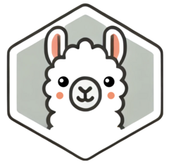

Desarrollado por Hause Lin y Tawab Safi, ollamar integra R con Ollama, para ejecutar modelos de lenguaje localmente.

Con ollamar podemos cargar diferentes modelos, interactuar con objetos que almacenan historias de chat y manejar los resultados como data frames, listas o vectores.

Funciona bien con httr2, lo que es un gran ventaja.

### [rollama](https://jbgruber.github.io/rollama/)

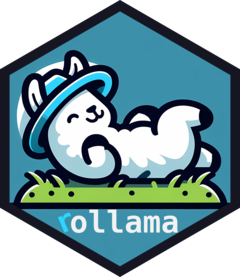

rollama, por  Johannes Gruber y Maximilian Weber, sirve para comunicarnos con la API de Ollama. Una vez que cargamos un modelo, podemos trabajar localmente con varios LLMs y realizar tareas como anotación y tareas de _embedding_ de texto.

Las funciones R utilizadas para interactuar con Ollama incluyen un argumento útil para especificar el formato de la respuesta (por ejemplo, si queremos texto plano, listas, data frames, httr2, etc.). El paquete tiene buena documentación y guías útiles para diferentes usos.

## Ayuda con pruebas unitarias

### [ensure](https://simonpcouch.github.io/ensure/)

ensure es otro paquete desarrollado por Simon Couch que nos ayuda a escribir código para implementar pruebas unitarias utilizando el paquete testthat. Funciona a través de un _addin_ de RStudio y la documentación menciona que el modelo está 'enterado' de la sintaxis de testthat y de la guía de estilo "tidy style guide" para formatear código. Lo pienso probar para avanzar con uno de mis paquetes más recientes que aún tienen una cobertura de pruebas muy pobre.

> groqR y PerplexR (ver arriba) tienen funciones específicas para crear pruebas unitarias.

## Evaluación de modelos

### [vitals](https://vitals.tidyverse.org/)


vitals es un paquete desarrollado por Simon Couch para evaluar el desempeño de difentes modelos. Se le dan _inputs_ (tareas o preguntas) y _targets_ (las respuestas o soluciones que esperamos) y de ahí los modelos que están siendo evaluados contestan los problemas y son evaluados en su desempeño. Aquí hay dos ejemplos ([1](https://www.simonpcouch.com/blog/2025-04-01-gemini-2-5-pro/#an-r-eval-dataset), [2](https://www.simonpcouch.com/blog/2025-05-21-gemini-2-5-flash/))de como comparar el desempeño de diferentes modelos para programar en R, todo usando vitals. 

## mlverse

### [mall](https://mlverse.github.io/mall/)


mall es parte del ecosistema de paquetes de ciencia de datos y Aprendizaje Automático de código abierto mlverse. En lugar de un enfoque basado en chats, mall aplica LLMs fila por fila en las columnas de un data frame. Incluye métodos para integrados para traducir, resumir, extraer y analizar el sentimiento de cadenas de texto.

mall utiliza Ollama y se implementa tanto en R como en Python. Es probable que lo utilice para analizar los comentarios que recopilé sobre paquetes cargados, lo que presenté en mi charla en posit::conf(2024).
### [lang](https://mlverse.github.io/lang/)

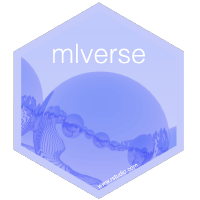

lang también forma parte del 'mlverse'. lang usa modelos locales para traducir la documentación de cualquier paquete de R a otro idioma para consultarlo en el panel de ayuda de R base, Rstudio, o Positron. Me preocupa un poco la traducción automática de términos específicos en programación y estadística, pero seguramente igual le va ayudar a muchas personas poder revisar la ayuda traducida. 

Lo que más me gustó del paquete es que también ayuda a generar infraestructura para desarrollar paquetes con documentación multilenguaje. 

### [chattr](https://mlverse.github.io/chattr/)

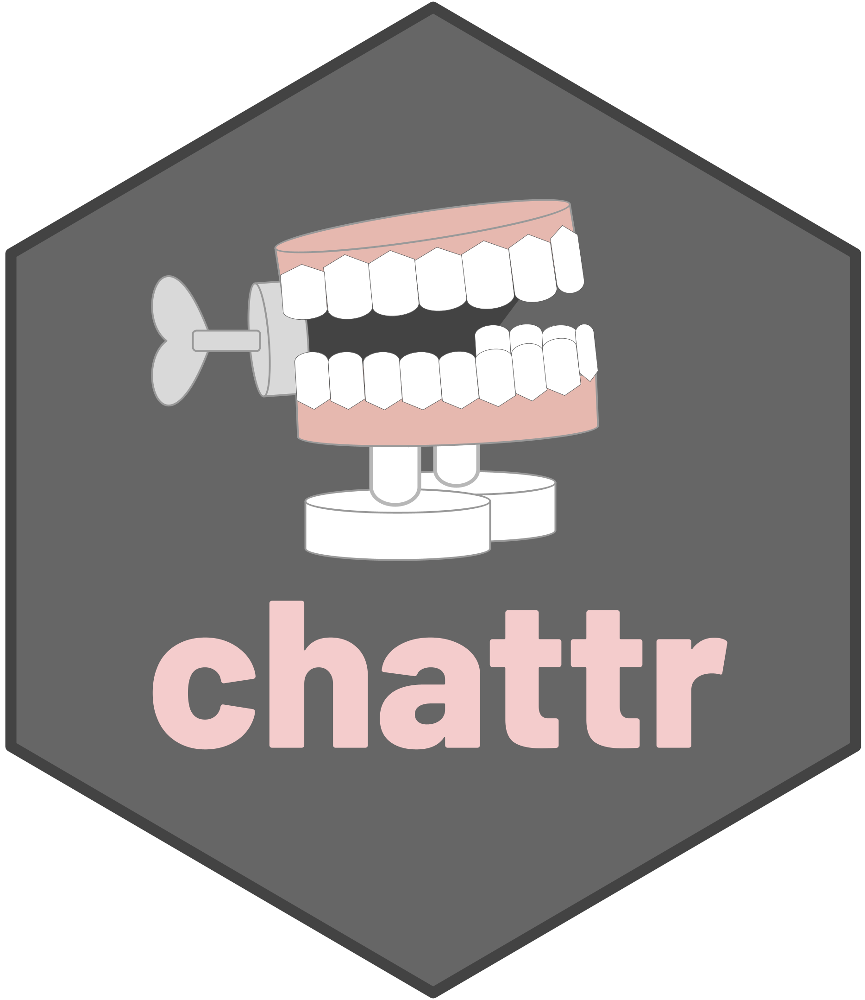

chattr también es parte del mlverse. El paquete es un interfaz para modelos locales, para CoPilot, o los modelos de Databricks. El paquete tiene varias opciones para interactuar con modelos dentro de RStudio (y puede tomar de contexto los objetos del entorno y archivos en el directorio de trabajo), incluyendo una aplicación Shiny bastante intuitiva. 


## Herramientas para usar el Protocolo de Contexto de Modelo (Model Context Protocol, MCP)

### [acquaint](https://posit-dev.github.io/acquaint/)

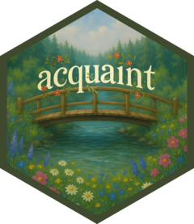

acquaint por Simon Couch, Charlie Gao y Winston Chang (y muchos otros colaboradores) permite que herramientas de MCP como Claude Desktop, Lutra, Glama y Claude Code se conecten directamente a nuestras sesiones de R. MCP es un protocolo abierto desarrollado por Anthropic para conectar modelos de IA a diferentes herramientas y fuentes de datos de manera estandarizada (el sitio web de MCP se refiere al protocolo como el puerto USB-C de las aplicaciones de IA). En esta configuración, los modelos pueden ver nuestros paquetes instalados, el entorno, y la información de la sesión, por lo que generarán código mejor informado. El paquete acquaint usa btw para proporcionar contexto a los modelos. Le veo mucho potencial.


## ellmer y compañia

### [ellmer](http://ellmer.tidyverse.org/)


> ellmer antes se llamaba elmer pero le cambiaron el nombre a finales de 2024 para evitar conflictos de nombre con el paquete ELMER que está en bioconductor.

ellmer es un nuevo paquete vinculado al tidyverse y desarrollado por Hadley Wickham y Joe Cheng. El paquete nos ayuda a interactuar en R con modelos locales y con prácticamente todos los proveedores. Podemos interactuar interactivamente a través de un chat en nuestra consola de R o programáticamente al incorporar objetos y métodos de ellmer en nuestras funciones. Las interacciones en ellmer quedan como objetos de chat de clase R6 que se acuerdan del contexto. 

ellmer promete bastante. Hay mucha gente contribuyendo, se está incorporando como base para otros paquetes, y cada que reviso tiene nuevas funcionalidades y mejor documentación.

### [btw](https://posit-dev.github.io/btw/) 

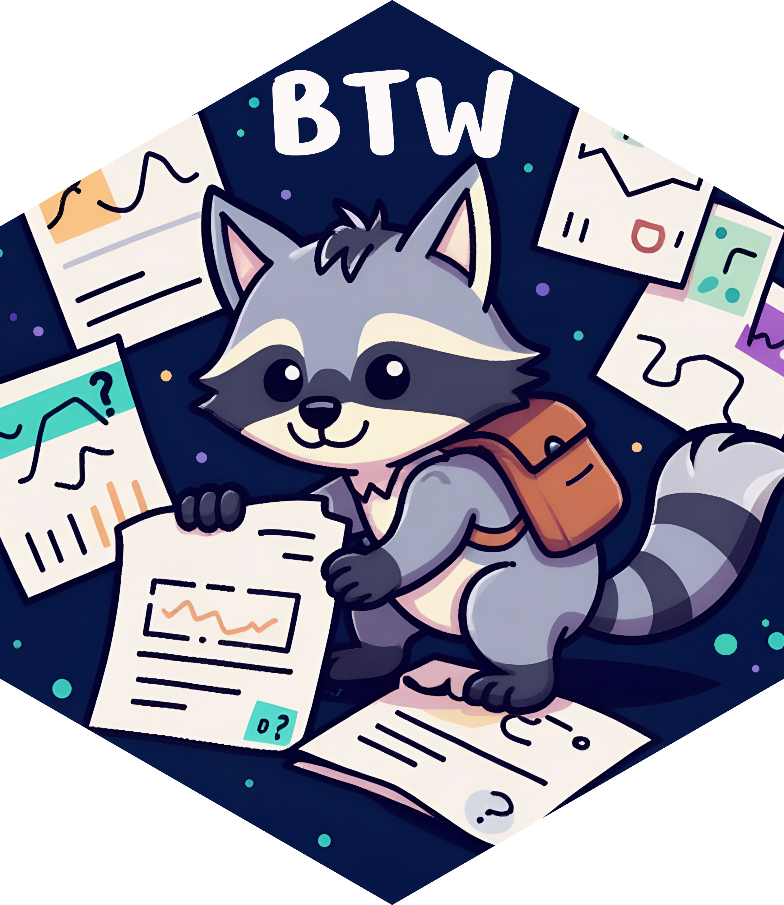

Como dice su documentación oficial, btw nos ayuda a describirle nuestro entorno de cómputo a un LLM. Ésto significa que le podemos dar a los objetos de chat de ellmer la capacidad de revisar documentación, y de chusmear objetos en el entorno de R y archivos en el directorio de trabajo. btw está en desarrollo  constante por parte de Garrick Aden-Buie, Simon Couch, y Joe Cheng, así que podemos esperar que funcione bien. Podemos usar btw interactivamente para procesar objetos y documentación y que éstos pasen al portapapeles como texto, pero también hay funciones para que los objetos de chat de LLM ya tengan esta capacidad automáticamente. Muy buen complemento para ellmer. 


### [buggy](https://simonpcouch.github.io/buggy/)

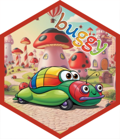

El paquete buggy, desarrollado por Simon P. Couch, usa LLMs para ayudar a los usuarios de R a entender y resolver mensajes de error. Teniendo el paquete configurado y activado correctamente, cada vez que se produce un error, el paquete nos ofrece enlaces que podemos clickear para “explicar” o “solucionar” el problema. Las explicaciones se muestran en la consola, mientras que las soluciones se implementan directamente. buggy como varios otros paquetes relacionados usa btw para proporcionarle contexto al modelo sobre los archivos y funciones relevantes. ¡Muy útil!

### [hellmer](https://dylanpieper.github.io/hellmer/)

Para trabajar en lotes (_batch processing_) con los chats de ellmer y sus salidas, Dylan Pieper ideó hellmer. El paquete se lleva bien con ellmer y tiene varias funciones útiles, barritas que muestran el progreso, y nos da mensajes informativos mientras trabaja. 

Para probar el paquete yo corrí este ejemplo con Gemini y funcionó super bien:

```{r}
#| eval: FALSE
library(hellmer)
chat <- chat_batch(chat_gemini, system_prompt = "Reply concisely in Spanish")

prompts <- list(
  "What is factorial 10?",
  "Name three Metallica Song",
  "Count to 3.",
  "Say hello.",
  "What is the Capital of Ghana?"
)

result <- chat$batch(prompts)
result$texts()
```

Los resultados:

```{r}
#| eval: false

result$texts()
[[1]]
[1] "3,628,800\n"
[[2]]
[1] "*   Enter Sandman\n*   Master of Puppets\n*   Nothing Else Matters\n"
[[3]]
[1] "Uno, dos, tres.\n"
[[4]]
[1] "Hola.\n"
[[5]]
[1] "Acra.\n"
```

### [chores](https://simonpcouch.github.io/chores/)

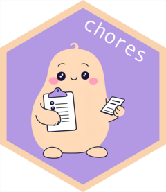

> chores antes era pal pero le cambiaron el nombre. Este [issue](https://github.com/simonpcouch/chores/issues/83) de GitHub explica el motivo para el cambio de nombre.

chores es otro paquete por Simon Couch que nos brinda asistentes amigables que pueden editar, documentar, o explicar nuestro código. Funciona con addins que pueden correr en RStudio o Positron. Buena opción para automatizar la creación de código repetitivo y no tener que hacer algunas tareas tediosas a mano al programar. Funciona con casi cualquier modelo. 

-  Aquí encontré un [tutorial](https://bastianolea.rbind.io/blog/pal_asistentes_llm/) en español para crear asistentes orientados a diferentes roles.

### [ggpal2](https://github.com/frankiethull/ggpal2)

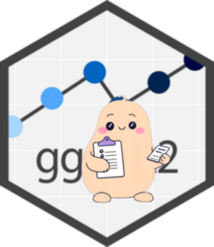

ggpal2 es una extensión para `chores`, desarrollada por Frank Hull. ggpal2 nos aporta asistentes basados en LLM diseñados específicamente para trabajar con  `ggplot2`. Como con chores o gander, solo tenemos que seleccionar algúna sección código o texto que describa lo que queremos hacer y llamar al addin con un atajo de teclado. Algunas de las cosas que podemos hacer es pasar código de R base a ggplot, crear gráficos a partir de comentarios, u obtener sugerencias para mejorar la legibilidad de nuestros gráficos existentes.

ggpal2 es un buen ejemplo de como se pueden escibir extensiones para chores, principalmente a través un un conjunto de prompts bien diseñados..

### [gander](https://github.com/simonpcouch/gander/)


Otro paquete más desarollado por Simon Couch, que publicó gander a principios de 2025. 

gander aprovecha ellmer para poder ir más allá de un chat en la consola o en alguna cajita y más bien brindar un asistente útil para nuestro IDE favorito. gander funciona bien en RStudio o Positron, y lo interesante es puede buscar contexto para las tareas en los objetos de nuestro entorno, o en los archivos de nuestro directorio de trabajo.

Una breve animación de cómo se puede usar:

<figure><a href="https://github.com/user-attachments/assets/4aead453-c2f2-446b-8e81-9154fd3baab0"></a></figure>

gander ya tiene una [introducción oficial](https://posit.co/blog/introducing-gander/) el blog de Posit (publicado el 17/03/2025).

## Herramientas para RAG

### [ragnar](https://tidyverse.github.io/ragnar/)

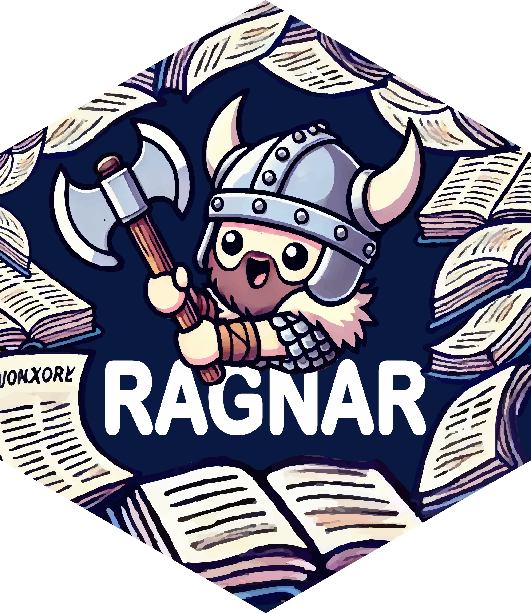

ragnar es un paquete desarrolado por Tomasz Kalinowski para implementar _generación aumentada por recuperación_  (RAG: Retrieval-Augmented Generation) en R. Esto no es más que vincular un modelo de lenguaje de gran escala con fuentes externas de información para obtener mejores respuestas.

ragnar usa duckdb por defecto entonces el trabajo con datos masivos es eficiente. Podemos conectar modelos locales de Ollama y usar modelos de openAI (vendrán más en el futuro).

**ragnar ahora es parte de la organización de tidyverse en GitHub entonces supongo que se vienen cosas interesantes.**

Me gustó el ejemplo que aparece en el README del paquete, que muestra como ingerir los contenidos de **R for Data Science** para preguntar cosas sobre R y obtener respuestas certeras y con fuentes genuinas y útiles.

### [rdocdump](https://www.ekotov.pro/rdocdump/)

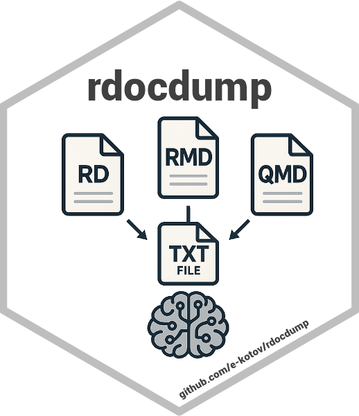

rdocdump es una librería desarrollada por Egor Kotov  que nos ayuda a convertir todo el código fuente y la documentación de un paquete a texto sencillo y guardarlo todo en un solo archivo. Este archivo sirve para usarlo en aplicaciones de RAG. Funciona con paquetes ya instalados, con archivos comprimidos (tar.gz), o descarga paquetes desde CRAN cuando no están instalados.

### [pkgprompt](https://github.com/simonpcouch/pkgprompt)

Puse en esta sesión a pkgprompt porque es para convertir la documentación de un paquete de R en texto plano listo para que lo digiera un LLM. Este es otro paquete más escrito por Simon Couch, y puede convertir todo la documentación de una vez o solo algún tema en espefícico a través del argumento `topics`.

## Visión por computadora

### [kuzco](https://github.com/frankiethull/kuzco)


kuzco es un paquete desarrollado por Frank Hull y Johannes Breuer, que usa  ollamar y ellmer para traer un asistente de 'computer vision' a nuestra sesión de R. Usa herramientas de LLM en lugar de torch para poder clasificar, reconocer, o  extraer texto de una imagen. Los resultados salen en tibbles bien ordenaditas.

Me gustó mucho el logotipo del paquete y ejemplo en su página de inicio es un cachorrito :3

## Transformers

### [pangoling](https://docs.ropensci.org/pangoling/index.html)

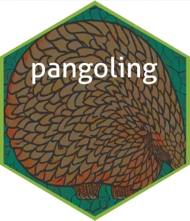

Bruno Nicenboim, Chris Emmerly, y Giovanni Cassani desarrollaron pangoling, un paquete para estimar que tan predecible es una palabra en un contexto dado usando modelos de tipo transformer (como GPT-2 or BERT). Estas probabilidades al parecer se usan mucho en estudios psicolinguísticos.

Me gustó mucho ver un paquete de rOpenSci en este campo.

## Búsquedas desde R

### [searcher](https://r-pkg.thecoatlessprofessor.com/searcher/)


searcher es un paquete enfocado a brindarnos una interfaz de búsqueda directamente dentro de R. Desarrollado por James Balamuta, searcher tiene funciones para hacer búsquedas en distintos buscadores web pero también tiene integración con asistentes de IA, que al hacer búsquedas o preguntas nos abre un navegador listo para contestar. Por ejemplo, con la función `ask_claude()` o `ask_perplexity()`.

