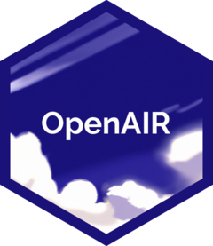
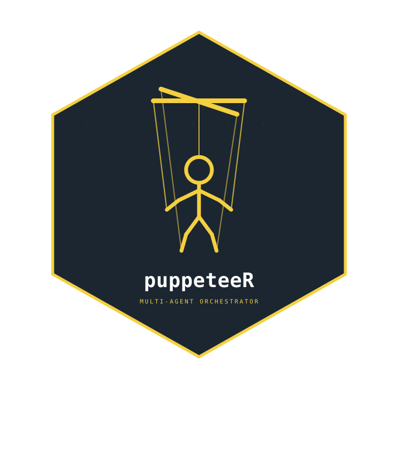
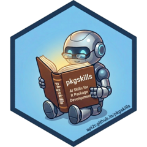
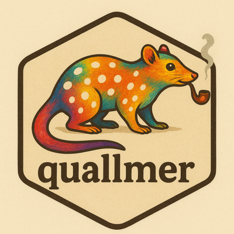
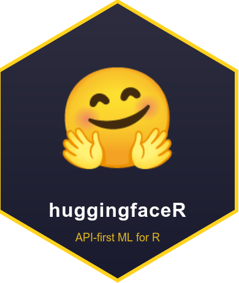

# Paquetes de R {#sec-r-pkgs}

Esta sección incluye paquetes de R que se conectan con APIs de LLM o proporcionan ayudantes, chats o complementos relevantes.

Los paquetes están resumidos aquí sin ningún orden en particular, pero los junté en categorías generales:

## Interfaces generales

### [aisdk](https://yulab-smu.top/aisdk/)

aisdk de Yonghe Xia y el equipo de YuLab-SMU es un Kit de Desarrollo de Software de IA (SDK) para R apto para producción que ofrece una interfaz unificada para interactuar con LLMs, abstrae detalles específicos de cada proveedor. aisdk es un poco como ellmer, pero también incluye muchas funciones avanzadas como salidas estructuradas, comprobaciones de AST, generación de imágenes, tool calling y orquestación de múltiples agentes. Un “todo en uno” muy completo para trabajar con LLMs en R.

### [llm.api](https://github.com/cornball-ai/llm.api)
<a href="https://cran.r-project.org/package=llm.api"><\/a>

llm.api es parte del conjunto _cornyverse_ de paquetes asociados a LLM desarrollados por Troy Hernandez. Similar a ellmer, llm.api proporciona una interfaz de chat LLM minimalista y con pocas dependencias, que se integra con varios proveedores como OpenAI, Anthropic, Google y varios modelos locales. Simplifica las interacciones con LLMs y soporta funciones como historial de conversación y streaming. Muy ligero y eficiente.

### [promptmanageR](https://github.com/lazasaurus-ai/promptmanageR)


promptmanageR es otra implementación por Lázaro Álvarez, basada en el ‘Prompt Hub’ de Langsmith. El paquete está diseñado para aportar estructura y flexibilidad a la ingeniería de prompts, separando la lógica del código. Con promptmanageR podemos almacenar prompts de sistema y de usuario en archivos JSON externos, inyectar variables dinámicas (por ejemplo, aplicar {{model_x}} a {{dataset_y}}), y renderizar prompts completamente sustituidos al momento de la ejecución. Esto va a servir para tener flujos de trabajo de IA reproducibles y mantenibles. El paquete también puede inspeccionar el texto exacto que se envía al LLM antes de llamarlo. Además, promptmanageR sirve para cargar plantillas de prompts compartidas directamente desde el LangSmith Hub (con una clave API válida), que incluye patrones aprobados por la comunidad. Al igual que todos los paquetes de Lazaro, promptmanageR se integra super bien con ellmer.

### [TheOpenAIR](https://openair-lib.org/)



TheOpenAIR por Ulrich Matter y Jonathan Chassot integra modelos GPT de OpenAI en flujos de trabajo de R, ofreciendo funciones (wrappers) con funciones preconfiguradas para tareas como escribir pruebas, traducir código, refactorizar, comprobar que el código de R sea válido o trabajar con diferentes dialectos de R.


### [wizrd](https://lawremi.github.io/wizrd/)


Desarrollado por Michael Lawrence, wizrd es una adición reciente (julio 2025) al conjunto de paquetes que nos sirven como interfaz general para trabajar con LLMs en R. El paquete está diseñado para programar funciones que integran LLMs con entradas y salidas utilizando una gramática intuitiva. 

Me gustó particularmente el ejemplo que aparece en los manuales de cómo se configuran los agentes y luego se extienden para poder parametrizar los argumentos:

```{r}
#| eval: false

agent <- openai_agent("gpt-4o-mini", temperature = 0) |>
    instruct("Answer questions about this dataset:", mtcars)

parameterized_agent <- agent |>
    prompt_as("Analyze the relationship between {var1} and {var2}.")
parameterized_agent |> chat(list(var1 = "mpg", var2 = "wt"))

```

wizrd también incluye herramientas para MCP y RAG, lo cual es bastante impresionante.  

### [chatAI4R](https://kumes.github.io/chatAI4R/)
<a href="https://cran.r-project.org/package=chatAI4R"></a>


El paquete chatAI4R es una interfaz de chat para R. Desarrollado por Satoshi Kume, este paquete funciona con varias API de modelos (OpenAI, Gemini, io.net, Replicate, Dify y DeepL). chat4AIR tiene algunas funciones integradas más allá del simple chat, como construir funciones de R, ejecutar prompts simultáneamente en varios modelos mediante la API de io.net, interpretar resultados estadísticos, y más.


### [gptr](https://cran.r-project.org/web/packages/gptr/index.html)
<a href="https://cran.r-project.org/package=gptr"><\/a>

gptr por Wanjun Gu es una interfaz ligera y conveniente para R y la API de OpenAI, que simplifica las interacciones para diversas tareas de procesamiento de lenguaje natural. No había visto este paquete antes, pero es otra opción más para interactuar directamente con modelos de OpenAI desde la consola de R.

### [documentoR](https://github.com/MDRCNY/documentoR)


documentoR fue desarrollado para automatizar la generación de documentación de proyectos en R aprovechando los LLMs para: resumir archivos, datos, scripts y otros formatos comunes. Con la ruta de un directorio y un objeto de chat de ellmer, podemos procesar cada archivo, producir resúmenes individuales y, opcionalmente, compilarlos en un documentation.md unificado y un archivo README.md conciso derivado de los puntos clave. El paquete puede manejar los tipos de archivos más comunes y excluye cosas como .git o renv por defecto, y admite exclusiones personalizadas a través de un archivo exclude.txt. documentoR también incluye un modo de prueba (dry-run) para previsualizar las salidas sin invocar al LLM, lo cual es bueno para mantenerse al tanto del uso de la API y los tokens. Otro paquete de calidad de Lázaro Álvarez.

### [chatLLM](https://knowusuboaky.github.io/chatLLM/)

<a href="https://cran.r-project.org/package=chatLLM"></a>


Desarrolado por Kwadwo Daddy Nyame Owusu Boakye, chatLLM es otra opción útil para cuando necesitamos una interfaz consistente para modelos de prácticamente todos los proveedores (Anthropic, OpenAI, DeepSeek, Groq, DashScope y GitHub Models). chatLLM nos bridna una API única y uniforme para todos los modelos y nos permite especificar los roles que se les darán a los LLM (prompts del sistema, usuario, asistente). Funciona bien por sí solo, pero también se integra con LLMagentR para construir [LLMagentR](r-pkgs.qmd#LLMagentR). Ya está disponible en CRAN.

### [axolotr](https://github.com/heurekalabsco/axolotr)


axolotor por Matthew Hirschey y Pol Castellano Escuder es otro paquete que nos brinda una interfaz generalizada para interactuar con APIs de distintos proveedores de LLMs. El paquete tiene funciones para aprovechar herramientas que son específicas a cada proveedor o modelo. También funciona con modelos locales y con la modalidad de 'thinking' de Claude 3.7 Sonnet. Funciona con una familia de funciones `ask()` y me gustó su logotipo.

### [AIscreenR](https://mikkelvembye.github.io/AIscreenR/)
<a href="https://cran.r-project.org/package=AIscreenR"><\/a>


AIscreenR, desarrollado por Mikkel H. Vembye y Thomas Olsen tiene funciones para ayudarnos a filtrar títulos y resúmenes al realizar revisiones sistemáticas de literatura, cuando ya tenemos un archivo RIS utilizable. En general, el paquete apunta a mejorar la calidad del filtrado y reducir el tiempo dedicado al filtrado, en lugar de reemplazar por completo la revisión humana, lo cual me parece algo bueno. AIscreenR también incluye herramientas para hacer evaluaciones de calidad de los filtrados.

### [routerchainR](https://github.com/lazasaurus-ai/routerchainR)

routerchainR de Lázaro Álvarez es una implementación en R del concepto RouterChain de LangChain, construido para distribuir los prompts entrantes al LLM más apropiado según el tipo de contenido o la intención de la consulta (por ejemplo, generar código, chat, prosa). En lugar mandar todos los prompts y contexto a un modelo caro, el paquete utiliza un modelo "router" ligero para clasificar los prompts y distinguir entre código, prosa o consultas breves, y los reenvía automáticamente a un LLM predefinido y optimizado para cada tarea. Así podemos reducir los costos de inferencia y mejorar la calidad de la respuesta, cuando cada prompt es manejado por el modelo más adecuado. Súper útil e integrado estrechamente con el ecosistema ellmer.

### [tidyprompt](https://kennispunttwente.github.io/tidyprompt/)

<a href="https://cran.r-project.org/package=tidyprompt"></a>

tidyprompt por Luka Koning y Tjark Van de Merwe proporciona un marco útil para construir prompts y su lógica asociada. El "tidy" en el nombre está inspirado en la sintaxis de _pipes_ del tidyverse y conceptualmente usa una sintaxis aditiva para los prompts, similar a cómo construimos operaciones de datos complejas con dplyr o figuras con ggplot2. El paquete introduce "prompt wraps" como elementos modulares que se pueden encadenar para transformar prompts simples en más sofisticados, agregando simultáneamente funciones de extracción y validación para las respuestas del LLM. Algunas características clave incluyen la capacidad de forzar ciertos tipos de salidas (enteros, lógicos, JSON, patrones regex), mecanismos de reintento automático cuando las salidas no cumplen con los criterios de validación, modos de razonamiento, llamadas a funciones (permitiendo que los LLMs ejecuten funciones de R como herramientas), generación y evaluación de código, y verificación humana en el proceso.

Como ejemplo rápido, podemos hacer cosas como: `"¿Cuánto es 5+5?" |> answer_as_integer() |> send_prompt()`. 

tidyprompt funciona con cualquier proveedor y es  compatible con objetos de chat de ellmer, definiciones de salida estructurada y herramientas de servidor MCP.

### [chatgpt](https://github.com/jcrodriguez1989/chatgpt)

<a href="https://cran.r-project.org/package=chatgpt"></a>

El paquete chatgpt nos permite interactuar con modelos de OpenAI para obtener ayuda mientras programamos. El paquete fue desarrollado por [Juan Cruz Rodriguez](https://jcrodriguez.rbind.io/), entonces seguramente es robusto y bien diseñado, pues he trabajado con Juan en el pasado en mejoras para annotater. Este paquete ha estado disponible por un buen tiempo ya y de hecho antecede a la mayoría de las herramientas LLM existentes para R, lo que demuestra la visión y las ideas novedosas de Juan.

Después de configurar una clave de API, podemos trabajar con addins de RStudio pre-programados para hacer cosas útiles como optimizar, comentar, explicar, seleccionar o probar código (entre otras). Funciona con selecciones o archivos completos y el modelo predeterminado es gpt-4o-mini.

### [FakeDataR](https://zobaer09.github.io/FakeDataR/)

<a href="https://cran.r-project.org/package=FakeDataR"></a>


La privacidad siempre es un tema crítico al usar LLMs y quizás no queramos instalar y ejecutar modelos locales ni compartir nuestros datos con las APIs. Zobaer Ahmed creó FakeDataR como una manera fluida de abordar este problema, y en sus propias palabras:

Editar a mano conjuntos de datos reales para crear ejemplos “falsos” puede ser lento, frágil y riesgoso. FakeDataR funciona completamente en R. FakeDataR genera conjuntos de datos sintéticos que preservan la privacidad directamente a partir de tus datos reales en tu propia máquina. Refleja el _schema_, los tipos, los niveles de factores y la ausencia de valores; produce una copia sintética documentada; y mantiene los datos originales privados. Luego podemos compartir o subir los datos sintéticos a un LLM para prototipar prompts, depurar pipelines o solicitar ayuda, sin exponer información sensible y/o datos originales.

¡Un paquete muy útil para la privacidad!

### [groqR](https://gabrielkaiserqfin.github.io/groqR)

<a href="https://cran.r-project.org/package=groqR"></a>


groqR por Gabriel Kaiser es una interfaz de R para modelos proporcionados por [GroqCloud](https://groq.com/). Existe una opción de cuenta gratuita disponible en groQ que nos permite generar una clave de API. El paquete tiene una aplicación de Shiny para configurar los parámetros relevantes y la clave de API. Me gustó que hay muchos modelos nuevos e interesantes para elegir, y las respuestas del LLM son **suuuuper rápidas**.

groqR llegó a mi atención gracias a su propio desarrollador, entonces le pedí una breve descripción para esta guía. En palabras de Gabriel (traducidas del inglés):

> "groqR es tu compañero de programación en R impulsado por IA, 10 veces más rápido que los LLM convencionales, con la mayoría de los modelos disponibles de forma gratuita. Ejecuta funciones en selecciones de texto: simplemente llama a la función `rewriter()` después de copiar texto para obtener resultados directamente en tu Consola R y portapapeles. Al combinar la velocidad de Groq con el acceso basado en atajos a las funciones de `groqR`, los usuarios logran el entorno de codificación más rápido y eficiente en el ecosistema R. Impulsado por el modelo líder actual [Qwen QwQ 32B](https://groq.com/a-guide-to-reasoning-with-qwen-qwq-32b/), GroqR garantiza un rendimiento de vanguardia"


### [PacketLLM](https://github.com/AntoniCzolgowski/PacketLLM)

<a href="https://cran.r-project.org/package=PacketLLM"></a>

PacketLLM, desarrollado por Antoni Czolgowski nos trae chats interactivos con modelos de OpenAI (p. ej., GPT-4o y GPT-4.1) al panel de 'Viewer' de RStudio a través de una aplicación de Shiny que corre en este contexto. Muy útil para usuarios habituales de ChatGPT en el navegador, para reducir el cambio de contexto (context switching). El paquete ya está en CRAN.


### [gptstudio](https://michelnivard.github.io/gptstudio/)

<a href="https://cran.r-project.org/package=gptstudio"></a>


gptstudio de Michel Nivard, James Wade y Samuel Calderon es otra buena opción para acceder a LLMs localmente o desde varios proveedores (OpenAI, HuggingFace, Google, Anthropic, Perplexity, Azure y Cohere) directamente dentro de RStudio.

gptstudio funciona principalmente a través de una aplicación Shiny que se ejecuta en el panel de visualización y proporciona una ventana de chat y opciones para editar código en el editor. Tuve algunos problemas para hacer funcionar la aplicación en Linux, pero los desarrolladores parecen estar al [pendiente](https://github.com/MichelNivard/gptstudio/issues/179).

Me gustaron las advertencias que incluyen los autores en el README sobre la privacidad, seguridad y en general sobre no compartir datos sensibles con los proveedores de modelos.

### [llmR](https://github.com/bakaburg1/llmR)


llmr de Angelo D'Ambrosio proporciona una API unificada para interactuar con varios LLMs y proveedores a través de funciones con gramática y sintaxis consistentes. Permite cambiar fácilmente entre modelos. 

- Un paquete similar llamado [LLMR](https://cran.r-project.org/package=LLMR) apareció recientemente en CRAN, pero no pude encontrar mucha información al respecto.

### [LLMR](https://asanaei.github.io/LLMR)

<a href="https://cran.r-project.org/package=LLMR"></a> 


LLMR (diferente de llmR por la sensibilidad a mayúsculas/minúsculas) por Ali Sanaei es otra opción que podemos usar para interactuar con modelos de lenguaje de múltiples proveedores. Ya había mencionado el paquete en esta guía, pero antes no había mucha documentación. Ahora, LLMR cuenta con manuales muy útiles, incluyendo una viñeta sobre cómo construir pipelines para obtener salidas estructuradas a través de _schemas_.

### [tidychatmodels](https://tidychatmodels.albert-rapp.de/)


Una interfaz amigable con el estilo "pipe" para muchos proveedores de chatbots. Desarrollado por Albert Rapp, tidychatmodels sigue la naturaleza modular de tidymodels y usa httr2 para comunicarse con diferentes modelos. Buena documentación, ejemplos y un video tutorial claro en YouTube.

### [tidyllm](https://edubruell.github.io/tidyllm/)

<a href="https://cran.r-project.org/package=tidyllm"></a>


tidyllm de Eduard Brüll proporciona acceso amigable con el estilo "pipe" a múltiples APIs de LLM de una manera legible y amigable. Podemos pasar imágenes, documentos, videos y figuras que están el panel de gráficos a las funciones del paquete, y el paquete tiene una documentación muy completa. Se ve similar a ellmer, y tiene potencial para trabajo interactivo y para procesamiento por lotes. 

### [deepRstudio](https://kumes.github.io/deepRstudio/)

<a href="https://cran.r-project.org/package=deepRstudio"></a>


deepRstudio de Staoshi Kume brinda traducción por IA directamente a Rstudio. El diseño está muy interesante, porque está destinado a usuarios de R multilingües o equipos de datos que trabajan en diferentes idiomas. deepRstudio nos permite traducir comentarios de código seleccionados, documentación o cualquier texto al inglés o del inglés a muchos otros idiomas utilizando la API de DeepL. Está bueno poder llamar a las  funciones de traducción a través de addins de RStudio o atajos de teclado, lo que facilita trabajar en varios idiomas sin salir del IDE. Para este tipo de trabajo, la cuenta gratuita en DeepL debería ser suficiente.  

### [gemini.R](https://jhk0530.github.io/gemini.R/)

<a href="https://cran.r-project.org/package=gemini.R"></a>


El paquete gemini.R de Jinhwan Kim conecta R con el modelo Gemini de Google a través de la API de Gemini. Con una clave API válida, la función `gemini()` admite indicaciones de texto, y la función `gemini_image()` puede trabajar con imágenes.

El paquete también tiene un addin de RStudio para crear documentación en Roxygen, y lo probé hace poco con el modelo Gemini Flash 2 para extraer información de un documento escaneado y funcionó bien.

### [PerplexR](https://github.com/GabrielKaiserQFin/PerplexR/)

<a href="https://cran.r-project.org/package=perplexR"></a>


PerplexR de [Gabriel Kaiser](https://gabrielkaiserqfin.github.io/) proporciona una interfaz al estilo de groqR pero para los modelos sonar de Perplexity. Hace falta tener un plan de pago para generar la clave de API necesaria, así que todavía no lo he probado. El paquete funciona con un addin de RStudio y, al igual que groqR, incluye funciones útiles para reescribir código o crear pruebas unitarias.

También le pedí a Gabriel un texto breve sobre el paquete (traducido del inglés):

> "El objetivo de perplexR es ofrecer a los usuarios de R una interfaz intuitiva para aprovechar las capacidades de la API de Perplexity con suscripción Profesional. Al utilizar las funciones del paquete, los usuarios pueden mejorar su productividad en programación al incorporar Modelos de Lenguaje de Gran Escala. Además, perplexR incluye addins de RStudio, lo que permite una integración interactiva y eficaz con Perplexity."

### [air](https://github.com/soumyaray/air)

air, creado por Soumya Ray, es un asistente de inteligencia artificial para programación en R. Tiene el mismo nombre pero no tiene nada que ver con el formateador de código y el servidor de lenguaje _air_. El paquete utiliza modelos de OpenAI y tiene funciones que podemos usar en nuestras sesiones de R para preguntar cómo realizar tareas de programación en R (por ejemplo, `howto('extract the second element in a list')`) o para definir y explicar conceptos o bloques de código. Funciona a través de prompts predefinidos relacionados con la programación en R.


### [promptr](https://github.com/joeornstein/promptr)

<a href="https://cran.r-project.org/package=promptr"></a>


promptr, creado por Joe Ornstein, está específicamente diseñado para formatear y enviar prompts para un LLM y devolver las respuestas de la API de OpenAI en formato tabular. promptr también puede ayudarnos a formatear conjuntos de prompts de entrada e instrucciones para tareas de clasificación por lotes.

Aquí hay un ejemplo de `complete_prompt` con la frase que siempre uso en talleres sobre Modelos de Lenguaje de Gran Escala.

```{r}
# un solo token
promptr::complete_prompt("Después de tomar agua la perrita se fue a su cama a alimentar a sus")
```


### [llmclean](https://cran.r-project.org/web/packages/llmclean/index.html)
<a href="https://cran.r-project.org/package=llmclean"><\/a>


llmclean por Sadikul Islam detecta y sugiere correcciones para inconsistencias semánticas en data frames usando LLMs. El paquete tiene funciones para identificar problemas como variantes de abreviaturas, errores de dedo, y valores mal formados. llmclean produce un data frame ordenado que resume los problemas en los datos y sugieres posibles correcciones. El paquete puede trabajar con múltiples proveedores de modelos (con alternativas para trabajar sin conexión) y los métodos de limpieza de datos que usa siguen métodos y discusiones establecidas: "An introduction to data cleaning with R" de de Jonge y van der Loo (2013) y "Robust and efficient fuzzy match for online data cleaning" de Chaudhuri et al. (2003). 

La documentación podría estar más detallada, pero lo probé con resultados decentes. Me gusta que podamos crear un tibble con los problemas identificados y luego pasarlo a la función `apply_fixes()`. 


## Modelos locales: herramientas y ayudantes basados en Ollama

### [localLLM](https://www.eddieyang.net/software/localllm/)

<a href="https://cran.r-project.org/package=localLLM"></a>

localLLM de Eddie Yand y Yaosheng Xu nos permite ejecutar LLMs locales en nuestras máquinas desde R, utilizando el backend eficiente llama.cpp. Esto significa que podemos trabajar sin conexión y no necesitamos claves API. localLLM tiene funciones simples como quick_llama() para generar texto listo para usar, y las salidas están diseñadas para ser más reproducibles por defecto, incluso cuando cambiando la temperatura de muestreo. Después de instalar localLLM podemos usar install_localLLM() para obtener automáticamente el llama.cpp precompilado adecuado para nuestra máquina. Muy buena herramienta para ciertos campos científicos, porque toma en cuenta la privacidad y la reproducibilidad. Este paquete puede ser útil para tareas como el análisis de sentimientos o el para resumir datos.

### [shiny.ollama](https://github.com/ineelhere/shiny.ollama)

<a href="https://cran.r-project.org/package=shiny.ollama"></a>

shiny.ollama de Indraneel Chakraborty usa Shiny para proporcionarnos una interfaz amigable para interactuar sin conexión con LLMs de código abierto como Deepseek-r1, Llama y Qwen a través de Ollama. De esta manera podemos ejecutar modelos locales de forma privada y sin conexión. Este debería ser un desarrollo significativo para reducir la curva de aprendizaje y ayudar a más personas a usar modelos locales con una interfaz de amigable. Las características clave del paquete incluyen selección de modelos, cajita para chat, opción de exportar el historial, y control sobre la temperatura y la ventana de contexto. Necesita Ollama para correr.

### [ollamar](https://hauselin.github.io/ollama-r/)

<a href="https://cran.r-project.org/package=ollamar"></a>


Desarrollado por Hause Lin y Tawab Safi, ollamar integra R con Ollama, para ejecutar modelos de lenguaje localmente.

Con ollamar podemos cargar diferentes modelos, interactuar con objetos que almacenan historias de chat y manejar los resultados como data frames, listas o vectores.

Funciona bien con httr2, lo que es un gran ventaja.

### [rollama](https://jbgruber.github.io/rollama/)

<a href="https://cran.r-project.org/package=rollama"></a>


rollama, por  Johannes Gruber y Maximilian Weber, sirve para comunicarnos con la API de Ollama. Una vez que cargamos un modelo, podemos trabajar localmente con varios LLMs y realizar tareas como anotación y tareas de _embedding_ de texto.

Las funciones R utilizadas para interactuar con Ollama incluyen un argumento útil para especificar el formato de la respuesta (por ejemplo, si queremos texto plano, listas, data frames, httr2, etc.). El paquete tiene buena documentación y guías útiles para diferentes usos.

## Ayuda con pruebas unitarias

### [ensure](https://simonpcouch.github.io/ensure/)

ensure es otro paquete desarrollado por Simon Couch que nos ayuda a escribir código para implementar pruebas unitarias utilizando el paquete testthat. Funciona a través de un _addin_ de RStudio y la documentación menciona que el modelo está 'enterado' de la sintaxis de testthat y de la guía de estilo "tidy style guide" para formatear código. Lo pienso probar para avanzar con uno de mis paquetes más recientes que aún tienen una cobertura de pruebas muy pobre.

> groqR y PerplexR (ver arriba) tienen funciones específicas para crear pruebas unitarias.

## Evaluación de modelos

### [vitals](https://vitals.tidyverse.org/)

<a href="https://cran.r-project.org/package=vitals"></a>


vitals es un paquete desarrollado por Simon Couch para evaluar el desempeño de difentes modelos. Se le dan _inputs_ (tareas o preguntas) y _targets_ (las respuestas o soluciones que esperamos) y de ahí los modelos que están siendo evaluados contestan los problemas y son evaluados en su desempeño. Aquí hay dos ejemplos ([1](https://www.simonpcouch.com/blog/2025-04-01-gemini-2-5-pro/#an-r-eval-dataset), [2](https://www.simonpcouch.com/blog/2025-05-21-gemini-2-5-flash/))de como comparar el desempeño de diferentes modelos para programar en R, todo usando vitals. 

## Agentes de IA y asistentes

### [ravel](https://msaule.github.io/ravel/index.html)
<a href="https://cran.r-project.org/package=ravel"><\/a>


ravel por Markuss Saule se une a un grupo selecto de paquetes (side, myownrobs) y herramientas (Posit Assistant y Lotas IDE) que nos traen un asistente de IA multi-proveedor y consciente del contexto a RStudio. El asistente ravel entiende el contexto de R (código, objetos, cambios en git) para ayudar con análisis estadísticos, refactorización de código, elaboración de reportes de resultados y revisión de código. ravel también ve lo que hacemos con git para ayudar con el control de versiones. El paquete prioriza la seguridad con cambios “en etapas” (staged changes) y un enfoque en la aprobación humana.

Muy útil en su diseño intencional para trabajar con R en RStudio. Recomiendo ejecutar el asistente (que corre como una app Shiny) en la barra lateral que ahora tiene RStudio para un panel de altura completa.


### [gooseR🦆](https://github.com/blockbtheriault/gooseR)
<a href="https://cran.r-project.org/package=gooseR"><\/a>

gooseR por Brandon Theriault está pensado para integrar R con Goose AI, que es un agente de IA open-source, extensible, escrito en Rust, y que funciona con prácticamente todos los proveedores. Goose forma parte de la Agentic AI Foundation (AAIF) en Linux Foundation, que le da validez. Las funciones preconstruidas en gooseR incluyen herramientas para gestión de memoria, mejoras de visualización (tablas y gráficas) y automatización de flujos de trabajo, etc. gooseR permite guardar objetos de R en la memoria de Goose y, en general, gestionar proyectos de ciencia de datos. Parece una herramienta muy flexible y el paquete tiene varias viñetas muy completas.


### [puppeteeR](https://arnold-kakas.github.io/puppeteeR/)



puppeteeR por Arnold Kakas sirve para gestión y orquestación de agentes. Nos permite definir varios agentes LLM con diferentes roles, proveedores, herramientas e instrucciones, y luego conectarlos en flujos de trabajo donde cada uno puede actuar sobre un estado compartido, echar a andar el trabajo de forma condicional y pasar todo al siguiente paso. El paquete soporta _pipelines_ secuenciales, _routing_, y flujos de trabajo basados en grafos personalizados con checkpoints y revisión con participación humana.

Como una introducción útil a la motivación detrás de puppeteeR, el autor escribió que  
> "ellmer facilita las llamadas individuales a un LLM. Pero las tareas reales de automatización son de varios pasos: clasificar un documento, extraer datos clave, resumirlos, derivar a un especialista, obtener aprobación humana, reintentar si se rechaza. Armar todo ésto a mano con condiciones de if/else anidadas y pasar entre estados manualmente se vuelve un caos muy rápido." 

puppeteeR está construido sobre [ellmer](https://ellmer.tidyverse.org/) e inspirado en [LangGraph](https://github.com/langchain-ai/langgraph), con la intención de llevar la orquestación de agentes a R de forma idiomática.

### [pkgskills](https://pkgskills.api2r.org/index.html)



Los archivos de _skills_ para agentes LLM y otras herramientas similares están muy de moda, y pkgskills de Jon Harmon proporciona skills/habilidades personalizadas e instrucciones de agentes para mejorar el desarrollo asistido con IA de paquetes de R. Este paquete instala `AGENTS.md` y archivos de habilidades en un proyecto, dándole a los agentes de codificación contexto específico del proyecto. Incluye skills para: crear issues, implementar issues, escribir código, desarrollo guiado por pruebas, documentar funciones, búsqueda de código y uso del CLI de GitHub. Compatible con GitHub Copilot.


### [saber](https://github.com/cornball-ai/saber)

Aunque la mayoría de usuarios de R no necesitan profundizar mucho en la metaprogramación para las tareas diarias, el código en general es jerárquico y puede representarse naturalmente como un árbol: las hojas y las ramas representan símbolos y constantes. "saber" por Troy Hernandez analiza el Árbol de Sintaxis Abstracta (AST) del código de R para entender las relaciones estructurales entre funciones, paquetes y proyectos. Nos ayuda a gestionar el contexto de los agentes mapeando dependencias del código e identificando qué se rompe cuando se realizan cambios. Este [post](https://cornball.ai/posts/tokensvstrees/) de Troy explica el conflicto que ocurre al tokenizar código y, en última instancia, perder contexto al programar con asistentes potenciados por LLM. 

"saber" ayuda a que los agentes trabajen con código de R sin tener que adivinar nada. Se integra bien con Codex y Claude Code.

### [reviewer](https://github.com/simonpcouch/reviewer)

reviewer es otro paquete de Simon Couch, diseñado para brindar revisión de código interactiva impulsada por LLMs y ayudarnos a mejorar la calidad de nuestro código con sugerencias automatizadas para reproducibilidad, legibilidad y resiliencia. La función principal del paquete `review()` analiza scripts de R y abre una aplicación Shiny donde podemos ver y aceptar o rechazar interactivamente las recomendaciones. Estas sugerencias incluyen identificar paquetes redundantes, mejoras de código, y señalar problemas potenciales. reviewer está construido sobre ellmer, por lo que es compatible con múltiples proveedores de modelos. Simon mencionó esto durante un chat de Zoom del Data Science Labs y parece una herramienta muy práctica para desarrolladores que buscan mantener altos estándares de código sin revisión manual por pares. Me gustó ver la retroalimentación real en lugar de solo diffs para código revisado por LLM.

### [predictive](https://github.com/simonpcouch/predictive)

predictive por Simon Couch es un fork de databot por Joe Cheng, que es la versión temprana del asistente oficial de EDA Databot para Positron. predictive se ejecuta como una aplicación Shiny y está diseñado específicamente para modelado predictivo con tidymodels, a través de una interfaz interactiva para guiarnos a través de flujos de trabajo apropiados de aprendizaje automático, asegurando mejores prácticas como división apropiada de datos, remuestreo y evitar contaminación del conjunto de prueba. Después de recorrer la preparación inicial de datos y el análisis exploratorio, predictive colabora para echar a andar flujos de trabajo de modelado y mejorar el rendimiento predictivo a través de muchas iteraciones. La herramienta tiene ejecución de código asíncrona para manejar modelos que tardan mucho en correr y el asistente tiene herramientas especializadas para mantener una "postura" de modelado adecuada durante todo el proceso (por ejemplo, no estar demasiado ansioso por usar los datos de prueba (testing) prematuramente). Otra idea genial de Simon, quien por cierto solía ser parte del equipo de tidymodels.

### [llamaR](https://github.com/cornball-ai/llamaR)

Troy Hernandez es un máquina de paquetes relevantes, habiendo lanzado recientemente un gran conjunto de herramientas LLM para R y escritas en R. llamaR es un agente de codificación de IA construido completamente en R que se ejecuta en la terminal como un CLI, como Claude Code o Gemini CLI. llamar puede conectarse a varios proveedores (Anthropic, OpenAI, Ollama) a través de MCP y viene con herramientas prácticas como acceso a la terminal, operaciones de archivos, integración con Git y ejecución de código de R. También podemos usar "skills", que son archivos de instruccione sen Markdown que funcionan tanto en llamaR como en openclaw. llamaR fue desarrollado con el objetivo de minimizar dependencias, tiene un modo de voz opcional, historial de conversaciones con capacidad de búsqueda y la capacidad de funcionar como servidor y cliente MCP. Ya lo probé y está buenazo.

### [side](https://simonpcouch.github.io/side/)

side de Simon Couch nos permite usar un asistente de experimental, o "side::kick()", para tareas de ciencia de datos directamente en Rstudio. Ahora que Rstudio tiene un panel de altura completa en el que podemos vizualizar contenido HTML inclyendo aplicaciones de Shiny, podemos ejecutar el asistente en Rstudio de manera similar a las extensiones de IA en Positron y vscode/cursor/etc.
side está construido sobre ellmer, shinychat y btw. El asistente puede ver nuestro entorno de R, leer y escribir archivos, ejecutar código, ejecutar comandos de sistema, verificar la documentación de R e incluso seguir "habilidades" definidas por el usuario (guías Markdown para flujos de trabajo específicos). Funciona con cualquier modelo compatible con ellmer y mantiene la conversación a través de sesiones. OJO, que side es experimental y posit está desarrollando un asistente oficial para Rstudio que también va a vivir en la barra lateral.

### [ralphloop](https://github.com/lazasaurus-ai/ralphloop)


ralphloop se incorporó hace poco al universo de herramientas de R y LLM de Lázaro Álvarez. ralphloop implementa un flujo de trabajo persistente e iterativo para tareas impulsadas por LLM, esencialmente una adaptación en R del "Ralph Wiggum Plugin" para Claude Code de Anthropic, pero construido sobre ellmer. En lugar de trabajar en una ventana de chat, podemos ejecutar loops autónomos en los que un agente ejecuta planes de varios pasos, actualiza archivos y mantiene el estado a través de iteraciones. El bucle sigue indefinidamente hasta que el modelo emite un token de éxito específico y predefinido (por ejemplo, <promise>ALL TESTS PASS</promise>), asegurando que las tareas estén realmente terminadas antes de detenerse.

"Ralph Wiggum coding" (o el Ralph Loop) se refiere a un enfoque de LLM reciente llamado así por la actitud optimista y necedad de Rafa Gorgory (supongo). En la práctica, atrapamos a un LLM en un bucle "while" donde debe criticar y corregir continuamente su propio trabajo hasta que cumpla con una definición rigurosa de "listo".

### [deputy](https://jameshwade.github.io/deputy/)


deputy de James Wade implementa flujos de trabajo agénticos como el Claude Agent SDK (Kit de Desarrollo de Software) de Anthropic, pero en R. De esta manera podemos crear agentes que usan herramientas para realizar tareas complejas de múltiples pasos. deputy está construido sobre ellmer, por lo que es sirve con muchos modelos. Al crear estos agentes, el paquete tiene diferentes juegos de herramientas disponibles, como herramientas para operaciones de archivos, análisis o manipulación de datos y ejecución de código, siempre con control fino sobre los permisos que le damos al modelo de hacer cosas. Esto está más allá de mis habilidades, pero también hay _hooks_ para interceptar y modificar el comportamiento del agente en diferentes puntos y soporte para ir mostrando las salidas en tiempo real. 

### [debrief](https://github.com/r-lib/debrief)


debrief de Emil Hvitfeldt y el equipo de r-lib ofrece resúmenes y herramientas de análisis basadas en texto para el output de `profvis`, diseñadas para flujos de trabajo en terminal y para consumo por IA. Proporciona vistas como análisis de hotspots, árboles de llamadas y contexto de código fuente. debrief puede decirnos qué corrió lento, o qué líneas estaban “calientes”, o si había llamadas acaparando el tiempo de ejecución. Esto puede ayudarnos a tomar decisiones sobre el contexto de código y el comportamiento de memoria para optimizar. Para usuarios avanzados y desarrolladores.


### [MyOwnRobs](https://myownrobs.github.io/myownrobs/)


MyOwnRobs por Juan Cruz Rodriguez es lo más cercano que he visto a  Cursor pero para RStudio. El paquete se ejecuta como una aplicación de Shiny dentro del IDE y me impresionó mucho cómo el asistente es reconoce contexto en el entorno global y en las carpetaas y puede armar flujos de trabajo de múltiples pasos que incluyen operaciones con archivos.

Para probarlo le pedí al asistente que leyera algunos archivos .R 
en mi proyecto y creara nuevas versiones de ellos, traduciendo el código de R base a data.table y además ir traduciendo los comentarios del código entre inglés y español, y la salida fue exactamente lo que pedí. ¡Espero ver a más personas probar MyOwnRobs!

### [mini007](https://github.com/feddelegrand7/mini007)

<a href="https://cran.r-project.org/package=mini007"></a>


Mohamed El Fodil Ihaddaden publicó mini007 en julio de 2025. El paquete nos brinda herramientas y un entrono para crear agentes de LLM utilizando clases de tipo R6 y ellmer. Podemos crear múltiples agentes y asignarle a cada uno una tarea diferente. Éstos luego colaboran bajo la supervisión de un gerente o 'Lead Agent' para completar tareas como encontrar información sobre un tema, resumir, traducir y mucho más. Me parecenen muy buenas noticias ver más herramientas que se basan en ellmer para este tipo de trabajo. 

### [LLMAgentR](https://knowusuboaky.github.io/LLMAgentR/)

<a href="https://cran.r-project.org/package=LLMAgentR"></a>


Los agentes de LLM son aplicaciones que pueden abordar tareas relativamente complejas dividiéndolas en 'subtareas' que pueden resolverse usando diferentes herramientas y un flujo de operaciones que finalmente conduce a la respuesta deseada.

LLMAgentR de Kwadwo Daddy Nyame Owusu Boakye trae a R un marco de ejecución de grafos de estado. Este marco está inspirado en las arquitecturas LangGraph y LangChain y se utiliza para definir flujos de trabajo como grafos dirigidos donde los nodos representan funciones y las aristas definen cómo se ejecutan éstas. Se ejecutan en orden y este sistema  permite a los desarrolladores construir flujos de trabajo con una gestión más estructurada de los pasos intermedios (estados) y con un flujo de ejecución controlado.

LLMAgentR utiliza funciones de `chatLLM` para construir agentes para: generación de código, consultas SQL, limpieza de datos, investigación web, pronósticos temporales, visualización de datos y más.

El paquete tiene muchas dependencias, así que tengan paciencia en la instalación. Probé los agentes de limpieza de datos con buenos resultados, aunque estos flujos de trabajo iterativos consumen muchos tokens y las  cuentas gratuitas de la mayoría de los proveedores pueden no ser suficientes. ¡Una gran adición en general al espacio de LLM + R!


### [llmflow](https://github.com/Zaoqu-Liu/llmflow)

<a href="https://cran.r-project.org/package=llmflow"></a>

llmflow por Zaoqu Liu implementa la arquitectura ReAct (Razonamiento y Acción) para análisis de datos automatizados impulsados por LLMs. En este enfoque, los LLMs pueden resolver tareas analíticas complejas a través de ciclos iterativos de razonamiento, generación de código y ejecución. El paquete incluye funciones como `AutoFlow()` para análisis automatizado de principio a fin, `react_r()` para bucles ReAct multiturno (donde el LLM alterna entre hacer planes y ejecutar código de R), `response_to_r()` para ejecutar de forma segura el código generado por IA en sesiones aisladas, `response_as_json()` para salida estructurada, y `retrieve_docs()` para enriquecimiento RAG de nuestros prompts con documentación sobre funciones de R. llmflow está construido sobre el ecosistema de paquetes ellmer, por lo que funcionará con la mayoría de los proveedores de modelos.

llmflow nos permite hacer cosas como ejecutar `AutoFlow(llm, "Realizar regresión lineal de mpg en hp y wt usando mtcars")` y obtener un análisis completo con código ejecutable, visualizaciones e interpretaciones, todo sin intervención manual.

## mlverse

### [mall](https://mlverse.github.io/mall/)

<a href="https://cran.r-project.org/package=mall"></a>


mall es parte del ecosistema de paquetes de ciencia de datos y Aprendizaje Automático de código abierto mlverse. En lugar de un enfoque basado en chats, mall aplica LLMs fila por fila en las columnas de un data frame. Incluye métodos para integrados para traducir, resumir, extraer y analizar el sentimiento de cadenas de texto.

mall utiliza Ollama y se implementa tanto en R como en Python. Es probable que lo utilice para analizar los comentarios que recopilé sobre paquetes cargados, lo que presenté en mi charla en posit::conf(2024).

### [lang](https://mlverse.github.io/lang/)


lang también forma parte del 'mlverse'. lang usa modelos locales para traducir la documentación de cualquier paquete de R a otro idioma para consultarlo en el panel de ayuda de R base, Rstudio, o Positron. Me preocupa un poco la traducción automática de términos específicos en programación y estadística, pero seguramente igual le va ayudar a muchas personas poder revisar la ayuda traducida. 

Lo que más me gustó del paquete es que también ayuda a generar infraestructura para desarrollar paquetes con documentación multilenguaje. 

### [chattr](https://mlverse.github.io/chattr/)

<a href="https://cran.r-project.org/package=chattr"></a>


chattr también es parte del mlverse. El paquete es un interfaz para modelos locales, para CoPilot, o los modelos de Databricks. El paquete tiene varias opciones para interactuar con modelos dentro de RStudio (y puede tomar de contexto los objetos del entorno y archivos en el directorio de trabajo), incluyendo una aplicación Shiny bastante intuitiva. 


## Herramientas para usar el Protocolo de Contexto de Modelo (Model Context Protocol, MCP)

### [mcptools](https://posit-dev.github.io/mcptools/)

<a href="https://cran.r-project.org/package=mcptools"></a>


> mcptools antes se llamaba acquaint

mcptools por Simon Couch, Charlie Gao y Winston Chang (y muchos otros colaboradores) permite que herramientas de MCP como Claude Desktop, Lutra, Glama y Claude Code se conecten directamente a nuestras sesiones de R. MCP es un protocolo abierto desarrollado por Anthropic para conectar modelos de IA a diferentes herramientas y fuentes de datos de manera estandarizada (el sitio web de MCP se refiere al protocolo como el puerto USB-C de las aplicaciones de IA). En esta configuración, los modelos pueden ver nuestros paquetes instalados, el entorno, y la información de la sesión, por lo que generarán código mejor informado. El paquete acquaint usa btw para proporcionar contexto a los modelos. Le veo mucho potencial.

### [mcpr](https://mcpr.opifex.org/)


mcpr, desarrollado por John Coene de Opifex es una implementación en R del Protocolo de Contexto de Modelo (MCP), que permite que las aplicaciones escritas en R interactúen con LLMs a través de una interfaz estándar JSON-RPC 2.0. Podemos construir herramientas personalizadas y, en última instancia, integrarlas con Cursor, Claude Code y VS Code Agent Mode. Más importante aún, las herramientas de MCPR construidas con el paquete se pueden convertir en herramientas de ellmer y registrarse en una sesión de chat de ellmer. Aunque el MCP en general es un tema difícil para aprender, mcpr es una enorme contribución a R y una adición revolucionaria a este espacio.


### [ClaudeR](https://github.com/IMNMV/ClaudeR)


ClaudeR de Nykko Vitali proporciona una integración MCP para que Claude Desktop pueda ejecutar código de forma interactiva en una instancia activa de RStudio. Este paquete es un ejemplo muy bueno de MCP, creando una conexión bidireccional segura (no borra archivos, no ejecuta comandos de sistema, etc.) entre Claude y RStudio que nos permite trabajar junto con el LLM o dirigirlo para que realice tareas de forma autónoma, y podemos ver los resultados en tiempo real.

Este  [video](https://youtu.be/KSKcuxRSZDY?si=4c0R5rHnD84yWLv_) muestra como Claude (3.7 Sonnet) ejecuta un conjunto de instrucciones para realizar análisis y visualización de datos de forma autónoma dentro de la instancia de RStudio en ejecución.

Gracias al protocolo MCP, este paquete también debería funcionar con Cursor u otros servicios que permitan servidores MCP y puedan ejecutar RStudio.

## ellmer y compañia

### [ellmer](http://ellmer.tidyverse.org/)

<a href="https://cran.r-project.org/package=ellmer"></a>


> ellmer antes se llamaba elmer pero le cambiaron el nombre a finales de 2024 para evitar conflictos de nombre con el paquete ELMER que está en bioconductor.

ellmer es un nuevo paquete vinculado al tidyverse y desarrollado por Hadley Wickham y Joe Cheng. El paquete nos ayuda a interactuar en R con modelos locales y con prácticamente todos los proveedores. Podemos interactuar interactivamente a través de un chat en nuestra consola de R o programáticamente al incorporar objetos y métodos de ellmer en nuestras funciones. Las interacciones en ellmer quedan como objetos de chat de clase R6 que se acuerdan del contexto. 

ellmer promete bastante. Hay mucha gente contribuyendo, se está incorporando como base para otros paquetes, y cada que reviso tiene nuevas funcionalidades y mejor documentación.

### [quallmer](https://quallmer.github.io/quallmer/)
<a href="https://cran.r-project.org/package=quallmer"><\/a>



Soy fan de quallmer incluso antes de leer de qué trata el paquete, porque los autores (Seraphine F. Maerz y Kenneth Benoit) eligieron uno de mis animales favoritos para el logo.

quallmer es una caja de herramientas completa para codificación cualitativa asistida por IA para conjuntos de datos grandes, incluyendo textos, imágenes, PDFs y datos tabulares. Este paquete se basa en ellmer y nos permite aplicar _codebooks_ personalizados o ya incluidos para generar códigos cualitativos estructurados e interpretables. Todo el flujo de trabajo está cubierto, incluyendo funciones para codificar datos (`qlm_code()`), evaluar la fiabilidad entre evaluadores (`qlm_compare()`), validar la precisión de la IA contra estándares codificados por humanos (`qlm_validate()`), replicar sistemáticamente los hallazgos entre diferentes modelos (`qlm_replicate()`), y generar auditorías (`qlm_trail()`) para la credibilidad y reproducibilidad de la investigación cualitativa.

### [kbretrieveR](https://github.com/MDRCNY/kbretrieveR)


kbretrieveR por Lazaro Alvarez es un paquete para descargar fragmentos relevantes de una base de conocimiento (Knowledge Base) de AWS Bedrock, que nos permite proporcionarle información contextual privada a los modelos. kbretrieveR combina este contexto en el prompt que le enviamos a nuestro cliente de chat preferido (ej., `ellmer::chat_aws_bedrock()`). El paquete está en desarrollo pero parece super prometedor, y tuve la suerte de juntarme con Lazaro en posit::conf y hablar sobre algunas ideas muy interesantes que tiene sobre estos temas. Noten el perrito del logo :)


### [contextR](https://github.com/lazasaurus-ai/contextR)


contextR por Lazaro Alvarez es un paquete liviano y de pocas dependencias para implementar 'memoria conversacional' en R. Esto es similar y está basado en el módulo de memoria de LangChain para mantener un estado persistente entre llamadas. El buffer de memoria también se puede reutilizar para acumular el contexto. Este paquete tiene mucho potencial y además le doy 10/10 al logotipo.

### [btw](https://posit-dev.github.io/btw/) 


Como dice su documentación oficial, btw nos ayuda a describirle nuestro entorno de cómputo a un LLM. Ésto significa que le podemos dar a los objetos de chat de ellmer la capacidad de revisar documentación, y de chusmear objetos en el entorno de R y archivos en el directorio de trabajo. btw está en desarrollo  constante por parte de Garrick Aden-Buie, Simon Couch, y Joe Cheng, así que podemos esperar que funcione bien. Podemos usar btw interactivamente para procesar objetos y documentación y que éstos pasen al portapapeles como texto, pero también hay funciones para que los objetos de chat de LLM ya tengan esta capacidad automáticamente. Muy buen complemento para ellmer. 


### [buggy](https://simonpcouch.github.io/buggy/)


El paquete buggy, desarrollado por Simon P. Couch, usa LLMs para ayudar a los usuarios de R a entender y resolver mensajes de error. Teniendo el paquete configurado y activado correctamente, cada vez que se produce un error, el paquete nos ofrece enlaces que podemos clickear para “explicar” o “solucionar” el problema. Las explicaciones se muestran en la consola, mientras que las soluciones se implementan directamente. buggy como varios otros paquetes relacionados usa btw para proporcionarle contexto al modelo sobre los archivos y funciones relevantes. ¡Muy útil!

### ~~hellmer]~~

> el paquete fue eliminado de CRAN y el repositorio ya no existe. Supongo que el desarrollador tomó esta decisión porque el trabajo de lotes en ellmer mejoró lo suficiente. 

Para trabajar en lotes (_batch processing_) con los chats de ellmer y sus salidas, Dylan Pieper ideó hellmer. El paquete se lleva bien con ellmer y tiene varias funciones útiles, barritas que muestran el progreso, y nos da mensajes informativos mientras trabaja. 


### [chores](https://simonpcouch.github.io/chores/)

<a href="https://cran.r-project.org/package=chores"></a>


> chores antes era pal pero le cambiaron el nombre. Este [issue](https://github.com/simonpcouch/chores/issues/83) de GitHub explica el motivo para el cambio de nombre.

chores es otro paquete por Simon Couch que nos brinda asistentes amigables que pueden editar, documentar, o explicar nuestro código. Funciona con addins que pueden correr en RStudio o Positron. Buena opción para automatizar la creación de código repetitivo y no tener que hacer algunas tareas tediosas a mano al programar. Funciona con casi cualquier modelo. 

-  Aquí encontré un [tutorial](https://bastianolea.rbind.io/blog/pal_asistentes_llm/) en español para crear asistentes orientados a diferentes roles.

### [ggpal2](https://github.com/frankiethull/ggpal2)


ggpal2 es una extensión para `chores`, desarrollada por Frank Hull. ggpal2 nos aporta asistentes basados en LLM diseñados específicamente para trabajar con  `ggplot2`. Como con chores o gander, solo tenemos que seleccionar algúna sección código o texto que describa lo que queremos hacer y llamar al addin con un atajo de teclado. Algunas de las cosas que podemos hacer es pasar código de R base a ggplot, crear gráficos a partir de comentarios, u obtener sugerencias para mejorar la legibilidad de nuestros gráficos existentes.

ggpal2 es un buen ejemplo de como se pueden escibir extensiones para chores, principalmente a través un un conjunto de prompts bien diseñados..

### [gander](https://github.com/simonpcouch/gander/)

<a href="https://cran.r-project.org/package=gander"></a>


Otro paquete más desarollado por Simon Couch, que publicó gander a principios de 2025. 

gander aprovecha ellmer para poder ir más allá de un chat en la consola o en alguna cajita y más bien brindar un asistente útil para nuestro IDE favorito. gander funciona bien en RStudio o Positron, y lo interesante es puede buscar contexto para las tareas en los objetos de nuestro entorno, o en los archivos de nuestro directorio de trabajo.

Una breve animación de cómo se puede usar:

<figure><a href="https://github.com/user-attachments/assets/4aead453-c2f2-446b-8e81-9154fd3baab0"></a></figure>

gander ya tiene una [introducción oficial](https://posit.co/blog/introducing-gander/) el blog de Posit (publicado el 17/03/2025).


### [statlingua](https://bgreenwell.github.io/statlingua/)

<a href="https://cran.r-project.org/package=statlingua"></a>


statlingua, desarrollado por Brandon M. Greenwell, es otro paquete interesante que aprovecha ellmer y que es básicamente una herramienta de _prompt engineering_ para explicar resultados estadísticos en lenguage sencillo utilizando LLMs y contexto sobre nuestros análisis. Funciona para la mayoría de los objetos de modelo  estadístico (por ejemplo, `lm()`, `glm()`, `lmer()`, `gam()`, `survreg()`, `rpart()`) y el paquete está diseñado para ser extensible a otros tipos de modelo. El código se ve robusto y el paquete está muy bien documentado.

## Integraciones para Shiny

### [shinychat](https://posit-dev.github.io/shinychat/r/index.html)

<a href="https://cran.r-project.org/package=shinychat"></a> 

shinychat, del equipo de Shiny en Posit, nos ofrece componentes de interfaz de usuario (UI) fáciles de usar para agregar chats impulsados por Modelos de Lenguaje de Gran Escala (LLM) a nuestras aplicaciones de Shiny. Funciona para R y Python y sirve con muchísimos proveedores de modelos. shinychat usa ellmer y las respuestas del modelo fluyen directamente al chat en tiempo real.

### [querychat](https://posit-dev.github.io/querychat/r/index.html)

querychat también fue desarrollado por el equipo de Shiny en Posit, y este paquete nos proporciona un componente de chat listo para usar en aplicaciones Shiny que utiliza LLMs para consultar data frames mediante lenguaje natural. Lo más destacado de querychat es que el modelo seleccionado no tiene acceso a los datos más allá de los nombres de variables y de su estructura general. Más bien, querychat hace que los modelos construyan consultas SQL (que podemos ver si lo deseamos), que luego se ejecutan en nuestro sistema y así obtenemos nuestros resultados deseados. El paquete se demostró extensamente en posit::conf 2025 y también parece muy prometedor.


## Herramientas para RAG

### [ragnar](https://tidyverse.github.io/ragnar/)

<a href="https://cran.r-project.org/package=ragnar"></a>


ragnar es un paquete desarrolado por Tomasz Kalinowski para implementar _generación aumentada por recuperación_  (RAG: Retrieval-Augmented Generation) en R. Esto no es más que vincular un modelo de lenguaje de gran escala con fuentes externas de información para obtener mejores respuestas.

ragnar usa duckdb por defecto entonces el trabajo con datos masivos es eficiente. Podemos conectar modelos locales de Ollama y usar modelos de openAI (vendrán más en el futuro).

**ragnar ahora es parte de la organización de tidyverse en GitHub entonces supongo que se vienen cosas interesantes.**

Me gustó el ejemplo que aparece en el README del paquete, que muestra como ingerir los contenidos de **R for Data Science** para preguntar cosas sobre R y obtener respuestas certeras y con fuentes genuinas y útiles.

### [rdocdump](https://www.ekotov.pro/rdocdump/)

<a href="https://cran.r-project.org/package=rdocdump"></a>


rdocdump es una librería desarrollada por Egor Kotov  que nos ayuda a convertir todo el código fuente y la documentación de un paquete a texto sencillo y guardarlo todo en un solo archivo. Este archivo sirve para usarlo en aplicaciones de RAG. Funciona con paquetes ya instalados, con archivos comprimidos (tar.gz), o descarga paquetes desde CRAN cuando no están instalados.

### [pkgprompt](https://github.com/simonpcouch/pkgprompt)

Puse en esta sesión a pkgprompt porque es para convertir la documentación de un paquete de R en texto plano listo para que lo digiera un LLM. Este es otro paquete más escrito por Simon Couch, y puede convertir todo la documentación de una vez o solo algún tema en espefícico a través del argumento `topics`.

## Visión por computadora

### [kuzco](https://github.com/frankiethull/kuzco)


kuzco es un paquete desarrollado por Frank Hull y Johannes Breuer, que usa  ollamar y ellmer para traer un asistente de 'computer vision' a nuestra sesión de R. Usa herramientas de LLM en lugar de torch para poder clasificar, reconocer, o  extraer texto de una imagen. Los resultados salen en tibbles bien ordenaditas.

Me gustó mucho el logotipo del paquete y ejemplo en su página de inicio es un cachorrito :3

## Generación de imágenes

### [stableDiffusion4R](https://github.com/kumeS/stableDiffusion4R)

stableDiffusion4R de Satoshi Kume conecta R con APIs de Stable Diffusion para tareas de generación y transformación de imágenes. Podemos usar métodos de texto a imagen, escalado de imagen e imagen a imagen con este paquete. Utiliza las API de OpenAI o DreamStudio y el paquete tiene funciones preconstruidas para hacer cosas como generar imágenes usando Stable Diffusion o DALL.E.2, crear prompts específicos a la generación de imágenes, e incluso crear logotipos hexagonales.

### [diffuseR](https://github.com/cornball-ai/diffuseR)


diffuseR de Troy Hernandez es una implementación en R de modelos de difusión para  generar y manipularimágenes usando torch, sin depender en ninguna librería o instalación de Python. Está inspirado en la librería diffusers para Python que desarrolló Hugging Face. Actualmente implementa Stable Diffusion 2.1 y Stable Diffusion XL (SDXL), y puede crear imágenes a partir de texto o modificar imágenes existentes basándose en indicaciones de texto. Una advertencia rápida: el paquete requiere una instalación de torch, suficiente memoria para cargar los archivos del modelo y de preferencia una GPU para las partes pesadas del proceso. Se ven bastante bien los ejemplos de imágenes generadas que están en el Reamde del paquete.


## Transformers

### [LLMing](https://github.com/sliplr19/LLMing)

<a href="https://cran.r-project.org/package=LLMing"></a>

LLMing (lemming) de Lindley Slipetz y Teague Henry es un paquete compacto para el análisis de texto psicológico. Utiliza embeddings BERT y actualmente incluye funciones para la generación de texto y la detección de anomalías textuales. 


### [topics](https://www.r-topics.org/)

<a href="https://cran.r-project.org/package=topics"></a>


topics por Leon Ackermann, Zhuojun Gu y Oscar Kjell implementa  Análisis Diferencial de Lenguaje (Differential Language Analysis). Este paquete no es estrictamente una herramienta basada en LLM, pero podemos usar topics para visualizar patrones de lenguaje y además se vincula con los principios de text y talk. Requiere Java y por ende rJava (ay no).

### [pangoling](https://docs.ropensci.org/pangoling/index.html)

<a href="https://cran.r-project.org/package=pangoling"></a>


Bruno Nicenboim, Chris Emmerly, y Giovanni Cassani desarrollaron pangoling, un paquete para estimar que tan predecible es una palabra en un contexto dado usando modelos de tipo transformer (como GPT-2 or BERT). Estas probabilidades al parecer se usan mucho en estudios psicolinguísticos.

Me gustó mucho ver un paquete de rOpenSci en este campo.

### [huggingfaceR](https://github.com/farach/huggingfaceR)


huggingfaceR por Alex Farach, Sam Terfa y Jack Penzer es un paquete orientado a APIs que proporciona acceso nativo en R a los ~500,000 modelos de aprendizaje automático, embeddings y conjuntos de datos en el Hub de Hugging Face sin ninguna dependencia de Python. huggingfaceR nos trae una interfaz compatible con tidyverse para tareas comunes de NLP y ML, incluyendo clasificación de texto (análisis de sentimiento, clasificación zero-shot), embeddings de texto con cálculo de similitud semántica, chats con LLMs de código abierto, y generación de texto. Las salidas están estructuradas como tibbles ordenados que se integran bien con herramientas tidy en general, incluyendo flujos de trabajo de dplyr, tidymodels y tidytext. Con el paquete podemos ejecutar operaciones sofisticadas como búsqueda semántica, agrupación de documentos, extracción de temas o cargar conjuntos de datos de Hugging Face directamente como tibbles. Después de iniciar sesión con una clave API de Hugging Face, podemos buscar y explorar modelos en el Hub de Hugging Face e incluso incorporar embeddings como _features_ en _recetas_ de tidymodels. Esto nos permitirá usar modelos nuevos y útiles en R a través de una sintaxis familiar y compatible con pipes como:
`reviews |> mutate(sentiment = hf_classify(text))`

## Procesamiento de voz y audio

### [chatterbox](https://github.com/cornball-ai/chatterbox)

chatterbox por Troy Hernandez es una implementación de procesador de texto a voz de Resemble AI, escrita en R para síntesis de voz de alta calidad usando torch y sin dependencias de Python. chatterbox tiene una interfaz sencilla para clonación de voz y síntesis a partir de textos. De esta manera podemos convertir texto a voz usando muestras de audio de referencia. El paquete tiene soporte CUDA para aquellos con GPUs y funciones convenientes como `quick_tts()` para prototipos rápidos. chatterbox solo la cara del stack de cornballAI para convertir texto a voz. Las otras piezas de la maquinaria son:

- tts.api - Interfaz R unificada para múltiples backends de TTS
- cornfab - Aplicación Shiny para generación de voz
- chatterbox-tts-api - Contenedor Docker para Chatterbox
- qwen3-tts-api - Contenedor Docker para Qwen3-TTS

Troy escribió un buen resumen sobre el conjunto de herramientas. Más sobre esto [aquí](https://cornball.ai/posts/text-to-speech-in-r/).

### [whisper](https://github.com/cornball-ai/whisper)

<a href="https://cran.r-project.org/package=whisper"></a>

whisper por Troy Hernandez es una implementación nativa en R del modelo de voz a texto Whisper de OpenAI. La diferencia es que esta implementación está construida completamente con torch, eliminando dependencias de Python. El paquete ofrece una interfaz para convertir audio a texto con modelos de diferentes tamaños (desde el modelo tiny de 151MB hasta la variante large-v3 de 6.2GB). Podemos hacer transcripción multilingüe con optimización específica de idioma y traducción directa al inglés. whisper tiene gestión automática de modelos a través del caché de HuggingFace, selección flexible de dispositivo (CPU/CUDA) y audio de muestra incluido para pruebas rápidas. whisper nos trae reconocimiento automático de voz directamente en R con una simple llamada a `transcribe()`.

### [text](https://www.r-text.org/)

<a href="https://cran.r-project.org/package=text"></a>


El paquete text por Oscar Kjell, Salvatore Giorgi y Andrew Schwartz utiliza modelos basados en _transformers_ para analizar lenguaje natural. text nos da acceso a modelos de Hugging Face para transformar texto en embeddings de palabras y usarlos en otras tareas, incluyendo RAG. Una herramienta excelente para trabajos de NLP que también puede ayudar a los usuarios de LLM en general a entender mejor los embeddings de palabras.

text, junto con talk y topics (ver abajo), forma parte de el _R Language Analysis Suite_, un conjunto de tres paquetes relacionados desarrollados para trabajar con lenguaje natural.

### [talk](https://www.r-talk.org/)


El paquete talk por Oscar Kjell, Adithya Ganesan, Rajath Rao y Akshay Raghavan es similar a text, pero permite transcribir audio a texto y generar embeddings a partir de grabaciones de voz. Utiliza transformers de Hugging Face instalando los paquetes de Python relevantes en un entorno de conda.

## Búsquedas desde R

### [webretrieveR](https://github.com/lazasaurus-ai/webretrieveR )


webretrieveR de Lázaro Álvarez nos trae una interfaz ligera y optimizada para obtener información de la reddirectamente en R para su uso en flujos de trabajo de LLM. Admite búsquedas en DuckDuckGo (priorizando las respuestas instantáneas cuando están disponibles) y Wikipedia. Devuelve texto limpio y estructurado que podemos usar posteriormente, incluyendo canalizar este nuevo contexto a flujos de trabajo de ellmer. webretrieveR nos permite, en última instancia, enriquecer los prompts con contexto en tiempo real para obtener resultados más precisos y relevantes. Hay planes para agregar búsquedas en Brave, PubMed, arXiv, Bing y CRAN.

### [searcher](https://r-pkg.thecoatlessprofessor.com/searcher/)

<a href="https://cran.r-project.org/package=searcher"></a>


searcher es un paquete enfocado a brindarnos una interfaz de búsqueda directamente dentro de R. Desarrollado por James Balamuta, searcher tiene funciones para hacer búsquedas en distintos buscadores web pero también tiene integración con asistentes de IA, que al hacer búsquedas o preguntas nos abre un navegador listo para contestar. Por ejemplo, con la función `ask_claude()` o `ask_perplexity()`.


