# R Packages {#sec-r-pkgs}

This section includes R packages that interface with LLM APIs or provide helpers, chats, or relevant addins.

In no particular order, but now grouped into loose groups:

## General interfaces

### [promptmanageR](https://github.com/lazasaurus-ai/promptmanageR)

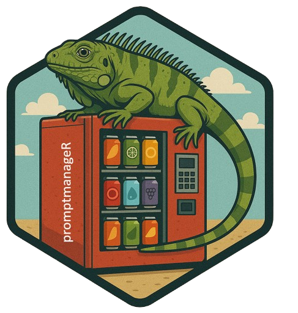

promptmanageR is another cool implementation by Lázaro Álvarez, based on Langsmith’s Prompt Hub. This package was designed to bring structure and flexibility to LLM prompt engineering by separating logic from code. With promptmanageR we can store system and user prompts in external JSON files, inject dynamic variables using placeholders (e.g., apply {{model_x}} to {{dataset_y}}), and render fully substituted prompts at runtime. This is great for reproducible and maintainable AI workflows. The package also has interactive preview functionality to inspect the exact text being sent to the LLM before calling it. Additionally, promptmanageR supports pulling shared prompt templates directly from the LangSmith Hub (with a valid API key) which includes community-vetted patterns. Like all of Lazaro’s packages, promptmanageR integrates smoothly with ellmer and friends.


### [wizrd](https://lawremi.github.io/wizrd/)

Developed by Michael Lawrence, wizrd is a recent addition to the set of packages that let us interface with LLMs in R. The package is designed to let us actually use program functions that integrate LLMs with inputs and outputs using an intuitive grammar.

I particularly liked the example from the package documentation of how agents are set up and then extended to take parametrized inputs like so:

```{r}
#| eval: false

agent <- openai_agent("gpt-4o-mini", temperature = 0) |>
    instruct("Answer questions about this dataset:", mtcars)

parameterized_agent <- agent |>
    prompt_as("Analyze the relationship between {var1} and {var2}.")
parameterized_agent |> chat(list(var1 = "mpg", var2 = "wt"))

```

wizrd also includes MCP and RAG tooling which is quite impressive.

### [chatAI4R](https://kumes.github.io/chatAI4R/)
<a href="https://cran.r-project.org/package=chatAI4R"></a>

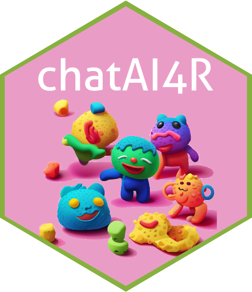

chatAI4R package is another new chat-based interface for R. Developed by Satoshi Kume, this package has support for various model APIs (OpenAI, Gemini, io.net, Replicate, Dify and DeepL). 

Chat4AIR has some cool built-in functions beyond just chat, like building R functions, running prompts simultaneously across models via the io.net API, interpreting, statistical outputs, and more. 


### [documentoR](https://github.com/MDRCNY/documentoR)

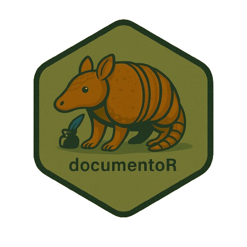

documentoR was built to automate the generation of project documentation in R by leveraging LLMs to summarize source files, data, notebooks, and other common formats. With a directory path and a compatible ellmer chat object, we can processes each file, produce individual summaries, and optionally compile them into a unified documentation.md and a concise README.md file derived from key excerpts. The package can handle standard file types while excluding directories like .git or renv by default, and supports custom exclusions via an exclude.txt file. documentoR also includes a dry-run mode to preview outputs without invoking the LLM, which is good for staying on top of API and token usage. As a research scientist I appreciate how the package was designed for reproducibility and streamlining the automated creation of up-to-date, meaningful project documentation. Another quality package by Lázaro Álvarez.


### [chatLLM](https://knowusuboaky.github.io/chatLLM/)

<a href="https://cran.r-project.org/package=chatLLM"></a>


chatLLM by Kwadwo Daddy Nyame Owusu Boakye is another useful option for when we want a consistent interface to models from essentially all providers (Anthropic, OpenAI, DeepSeek, Groq, DashScope, and GitHub Models). chatLLM provides a single and uniform API across all models and lets us specify the roles that the LLMs will be given (system prompts, users, assistants). Works nicely on its own but more importantly, the pacakge integrates with [LLMagentR](r-pkgs.qmd#LLMagentR) to build Language Model Agents.

### [axolotr](https://github.com/heurekalabsco/axolotr)


This package by Matthew Hirschey and Pol Castellano Escuder provides a unified interface for interacting with various Language Model APIs. axolotr has some useful functions to take advantage of provider-specific features, local model support, and support for Claude 3.7 Sonnet’s 'thinking' capability. Works through a simple family of `ask()` functions. Cute logo too.

### [routerchainR](https://github.com/lazasaurus-ai/routerchainR)

routerchainR by Lázaro Álvarez is an R implementation of LangChain’s RouterChain concept, built to route incoming prompts to the most appropriate LLM based on content type or query intent (e.g., coding, chat, prose). Rather than sending all prompts and context to a fancy (and often expensive) model, the package uses a lightweight, cost-effective "router" model to classify prompts and distinguish between code, prose, or short factual queries and automatically forwards them to predefined destination LLM optimized for each task. This approach helps reduce inference costs and improves response quality, making sure that each prompt is handled by the best-suited model. Super useful and integrated tightly with the ellmer ecosystem.


### [chatgpt](https://github.com/jcrodriguez1989/chatgpt)

<a href="https://cran.r-project.org/package=chatgpt"></a>

The chatgtp package lets us interface with models from OpenAI to get assistance while coding. The package was developed by [Juan Cruz Rodriguez](https://jcrodriguez.rbind.io/) so I know it's robust and well-engineered, having worked with Juan in the past on features for annotater. This package has been around for a while and actually predates most existing LLM tools for R, so more evidence for Juan's foresight and clever ideas.

After setting up an API key, we can work with pre-promted RStudio addins to do useful things like optimize, comment, explain, select, or test code (just to name a few). Works on selections or entire files and the default model is gpt-4o-mini.

### [FakeDataR](https://zobaer09.github.io/FakeDataR/)

<a href="https://cran.r-project.org/package=FakeDataR"></a>

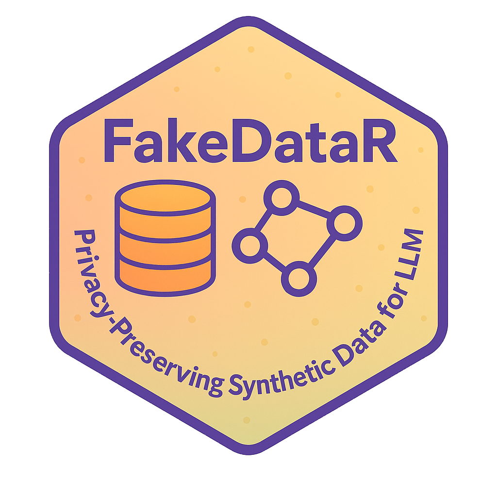

Privacy is always an issue when using LLMs and we may not want to set up and run local models nor share our data with the model APIs. Zobaer Ahmed created FakeDataR for a smooth way to tacke this problem, and in Zobaer's own words:

Hand-editing real datasets to make “fake” examples can be slow, brittle, and risky. FakeDataR runs entirely in R. FakeDataR generates privacy-preserving synthetic datasets directly from your real data on your own machine. It mirrors schema, types, factor levels, and missingness; produces a documented synthetic copy; and keeps original data private. You can then share or upload the synthetic data to an LLM to prototype prompts, debug pipelines, or request help, without exposing sensitive information and/or original data.

A very useful package for privacy!

### [groqR](https://gabrielkaiserqfin.github.io/groqR)

<a href="https://cran.r-project.org/package=groqR"></a>


groqR by Gabriel Kaiser is an R interface for models provided by [GroqCloud](https://groq.com/). A free tier is available and the package has a Shiny app setting up the relevant parameters and API key. I liked that here are lots of new and interesting models to choose from, and the LLM responses are **really fast** .

groqR was brought to my attention by it's own developer and I asked for a brief blurb for this guide. In Gabriel's own words:

> "groqR is your AI-powered R coding companion, 10x faster than conventional LLMs, with most models available free of charge. It executes functions on copied text: simply call the `rewriter()` function after copying text to retrieve results directly in your R Console and clipboard. By combining Groq's speed with shortcut-based access to `groqR` functions, users achieve the fastest, most efficient coding environment in the R ecosystem. Powered by the current leading model [Qwen QwQ 32B](https://groq.com/a-guide-to-reasoning-with-qwen-qwq-32b/), GroqR ensures cutting-edge performance"

### [PacketLLM](https://github.com/AntoniCzolgowski/PacketLLM)

<a href="https://cran.r-project.org/package=PacketLLM"></a>

PacketLLM by Antoni Czolgowski brings interactive chats with OpenAI models (e.g. GPT-4o and GPT-4.1) to the RStudio viewer pane via a Shiny App. Useful for habitual users of ChatGPT in the browser, to cut down on context switching. The package is now on CRAN.

### [gptstudio](https://michelnivard.github.io/gptstudio/)

<a href="https://cran.r-project.org/package=gptstudio"></a>


gptstudio by Michel Nivard, James Wade, and Samuel Calderon is another good option for accessing LLMs locally or from various providers (OpenAI, HuggingFace, Google, Anthropic, Perplexity, Azure, and Cohere) right inside RStudio.

gptstudio works mainly though a Shiny App that runs in the viewer pane and provides a chat window and options to edit code in the editor. I had some trouble getting the app to run on Linux, but the developers seem to be aware of [this](https://github.com/MichelNivard/gptstudio/issues/179).

I liked the clear and visible warnings and disclaimers in the README about privacy, security, and sharing sensitive data with model providers.

### [llmR](https://github.com/bakaburg1/llmR)

llmr by Angelo D'Ambrosio provides a unified API to interact with various LLMs and providers through functions with consistent grammar and syntax. Provides easy switching between models, logging, and nice strategies for when we hit rate limits. Seems similar to ellmer. Will try it soon.

### [LLMR](https://asanaei.github.io/LLMR)

<a href="https://cran.r-project.org/package=LLMR"></a>

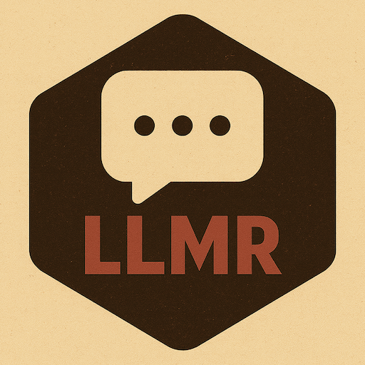

LLMR (different to llmR because of case-sensitivity) by Ali Sanaei is another option we can use to interface with LLMs from multiple providers. I had mentioned the package before on this page but at the time there was no documentation. Now LLMR has some very nice vignettes, including one on how to build pipelines for nice structured output by providing schemas.

### [tidychatmodels](https://tidychatmodels.albert-rapp.de/)


A pipe-friendly interface to many chatbot vendors. Developed by Albert Rapp, tidychatmodels follows the modular nature of tidymodels and uses httr2 to communicate with different models. Good documentation, examples, and a clear video walkthrough on YouTube.

### [tidyllm](https://edubruell.github.io/tidyllm/)

<a href="https://cran.r-project.org/package=tidyllm"></a>


tidyllm by Eduard Brüll provides pipe-friendly access to multiple LLM APIs in a smooth and readable way. We can pass images, documents, videos, and plots from the plot pane to the package functions, and the package has very thorough documentation. Similar in some ways to ellmer, but looks very useful for both batch processing and interactive work.

### [deepRstudio](https://kumes.github.io/deepRstudio/)

<a href="https://cran.r-project.org/package=deepRstudio"></a>

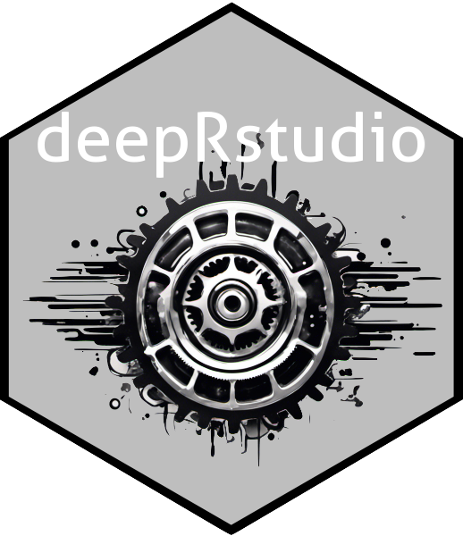

deepRstudio by Staoshi Kume brings AI-powered translation directly into Rstudio. Very interesting design, meant for multilingual R users or data teams. DeepRstudio lets us translate selected code comments, documentation, or any text to English or from English into  many other languages using the DeepL API. Very nice approach of calling translation functions through RStudio add-ins or keyboard shortcuts, making it easy to work across languages without leaving the IDE. For this kind of work the free tier on DeepL accounts should be generous enough. I’ll likely be using it for translating comments in my teaching materials.

### [gemini.R](https://jhk0530.github.io/gemini.R/)

<a href="https://cran.r-project.org/package=gemini.R"></a>


gemini.R by Jinhwan Kim connects R with Google's gemini model via the gemini API. With a valid API key, the `gemini()` function takes text prompts and the `gemini_image()` function can work with images and text prompts.

The package algo provides an RStudio addin for creating Roxygen documentation.

I recently used the Gemini Flash 2 model to pull information from a scanned PDF with decent success.

### [PerplexR](https://github.com/GabrielKaiserQFin/PerplexR/)

<a href="https://cran.r-project.org/package=perplexR"></a>


PerplexR by [Gabriel Kaiser](https://gabrielkaiserqfin.github.io/) provides an interface like the one in groqR but for the *sonar* models from [Perplexity](https://www.perplexity.ai/). A paid plan is required for generating the necessary API so I haven't tried it out yet. The package works with a handy RStudio addin and like groqR includes helpful functions for rewriting code or creating unit tests.

I also asked Gabriel for a brief summary of the package:

> "The objective of `perplexR` is to offer R users an intuitive interface for leveraging the capabilities of the Perplexity API [Pro subscription](https://docs.perplexity.ai/guides/getting-started). Utilizing the supplied functions, users can enhance their programming productivity by incorporating Large Language Models. Furthermore, `perplexR` includes RStudio add-ins, enabling seamless interactive integration of Perplexity prompts."

### [air](https://github.com/soumyaray/air)

Not to be confused with the R formatter and language server, air by Soumya Ray is an AI helper for R coding. The package uses OpenAI models and has functions which we can use in our R sessions to ask how to do coding tasks in R (e.g. `howto('extract the second element in a list')` or to define and explain concepts or blocks or code. Works through saved prompts related to R programming.

### [promptr](https://github.com/joeornstein/promptr)

<a href="https://cran.r-project.org/package=promptr"></a>

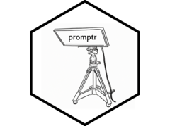

promptr by Joe Ornstein is specifically designed to format and submit LLM prompts and get the resulting model ouputs from the OpenAI API in a tabular format. promptr can also help us format sets of input prompts and instructions for batch classification tasks.

Here's an example of `complete_prompt` with the sentence I use whenever I teach or demonstrate LLMs.

```{r}
# with just one token to return
promptr::complete_prompt("After drinking some water, the dog went to bed feed her")
```

## Ollama-based tools, wrappers and helpers

### [localLLM](https://www.eddieyang.net/software/localllm/)

<a href="https://cran.r-project.org/package=localLLM"></a>

localLLM by Eddie Yand and Yaosheng Xu lets us run local LLMs on our local machines from R, using the efficient `llama.cpp` backend. This means we can work offline and don’t need API keys. LocalLLM has simple functions like `quick_llama()` to generate text out of the box and the outputs are built to be more reproducible results by default, even when sampling with temperature, thanks to deterministic decoding tuned by a user-specified seed. After installing localLLM we can `install_localLLM()` to automatically fetch the appropriate precompiled `llama.cpp` binary for our machine and operating system. Good tool for using in certain scientific fields because it has privacy and reproducibility in mind. This package can be useful for tasks like sentiment analysis or summarizing data .

### [shiny.ollama](https://github.com/ineelhere/shiny.ollama)

<a href="https://cran.r-project.org/package=shiny.ollama"></a>

shiny.ollama by Indraneel Chakraborty uses Shiny to provide us with a user-friendly interface for interacting offline with open-source Large Language Models (LLMs) like Deepseek-r1, Llama, and Qwen via Ollama. This way we can run models privately and offline. This should be a significant development to lower the learning curve and help more people use local models with a friendly UI. Key features include easy model selection, message input, chat history export, and control over temperature and context window. Needs Ollama to run.

### [ollamar](https://hauselin.github.io/ollama-r/)

<a href="https://cran.r-project.org/package=ollamar"></a>


Developed by Hause Lin and Tawab Safi, ollamar Integrates R with Ollama, for running language models locally.

With ollamar we can pull different models, interact with objects that store chat histories, and handle the outputs as data frames, lists, or vectors.

Works nicely with httr2, which is a big advantage.

### [rollama](https://jbgruber.github.io/rollama/)

<a href="https://cran.r-project.org/package=rollama"></a>


rollama by Johannes Gruber and Maximilian Weber wraps the Ollama API. Once we pull a model, we can work locally with various LLMs and perform tasks like annotation and text embedding.

The R functions used to interact with Ollama include a nice argument for specifying the format of the response (e.g., do we want plain text, lists, data frames, httr2, etc.). The package has useful vignettes for different usecases.

## Unit testing helpers

### [ensure](https://simonpcouch.github.io/ensure/)

ensure by Simon Couch helps write code for unit tests using the testthat package. Works through an Rstudio addin, and the documentation mentions that the model has been made aware of testthat syntax and the tidy style guide for code. Will be trying it out for my more recent packages that still have poor test coverage.

> groqR and PerplexR (see above) both have specific functions for creating unit tests

## Model evaluation

### [vitals](https://vitals.tidyverse.org/)

<a href="https://cran.r-project.org/package=vitals"></a>


vitals by Simon Couch provides us with a framework for evaluating LLMs. We provide inputs (prompts or questions) and targets (the actual response that we expect) and then our model or models of choice can give the problems a go and then get scored on their performace. These two posts ([1](https://www.simonpcouch.com/blog/2025-04-01-gemini-2-5-pro/#an-r-eval-dataset), [2](https://www.simonpcouch.com/blog/2025-05-21-gemini-2-5-flash/))include a detailed walkthrough of the evaluation process using vitals.

## Language Model Agents and AI assistants

### [ralphloop](https://github.com/lazasaurus-ai/ralphloop)


ralphloop is the latest addition to the set of great R&LLMs tools that Lázaro Álvarezan is working on. ralphloop implements a persistent, iterative agentic workflow for LLM-driven tasks, essentially an R port of the "Ralph Wiggum Plugin" for Anthropic's Claude Code but built on top of the ellmer framework. Rather than working in a chat windows, we can run autonomous loops in which an agent executes multi-step plans, updates files, and maintains state across iterations on disk rather. The loop continues indefinitely until the model outputs a specific, pre-defined success token or completion promise (e.g., <promise>ALL TESTS PASS</promise>), ensuring tasks are genuinely finished before stopping.  

"Ralph Wiggum coding" (or the Ralph Loop) refers to a somewhat recent LLM approach named after Ralph Wiggum’s optimistic/stubborn attitude (I guess). In practice, we trap an LLM in a while loop where it must continuously critique and correct its own work until it meets a rigorous definition of "done".

### [side](https://simonpcouch.github.io/side/)

side by Simon Couch lets us use an experimental coding assistant, or  “side::kick()” for data science tasks directly inside Rstudio. Now that Rstudio has a sidebar, or a full-height pane in which we can place the outputs from the Viewer such as Shiny apps, we can run the assistant in Rstudio similar to AI extensions in Positron and vscode/cursor/etc. side is built on top of ellmer, shinychat, and btw. The assistant can inspect our R environment, read and write files, execute code, run shell commands, check R documentation, and even follow user-defined “skills” (Markdown guides for specific workflows). Works with any model supported by ellmer and keeps a conversation state across R sessions. Note that side is experimental and posit is developing an official AI assistant meant for Rstudio that will also live in the sidebar.

### [deputy](https://jameshwade.github.io/deputy/)
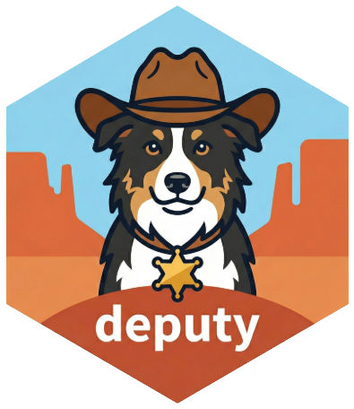

deputy by James Wade implements agentic workflows like Anthropic's Claude Agent SDK (Software Development Kit), but in R. This way we can create AI agents that use tools to perform complex, multi-step tasks. deputy is built on top of the ellmer framework so it is provider-agnostic and modular. When creating these agents, the package has pre-built tool bundles suchs tools for file operations, data analysis or wrangling, and code execution, always with fine-grained control on permissions. This is beyond my skillset but there are also hooks to intercept and modify agent behavior at different points and support for real-time streaming outputs. Nice!

### [MyOwnRobs](https://myownrobs.github.io/myownrobs/)

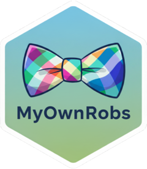

MyOwnRobs by Juan Cruz Rodriguez is the closest I've seen to a Cursor-style coding agent for RStudio. The package runs as a Shiny App in the viewer pane and I was very impressed with how the assistant is context-aware and can figure out multi-step workflows that include file operations.

I tried it out and asked the assistant to read some .R files in my project and create new versions of them, translating base code to data.table and also translating the code comments between English-Spanish and the output was exactly what I asked for. I hope to see more people try out MyOwnRobs!

### [mini007](https://github.com/feddelegrand7/mini007)

<a href="https://cran.r-project.org/package=mini007"></a>

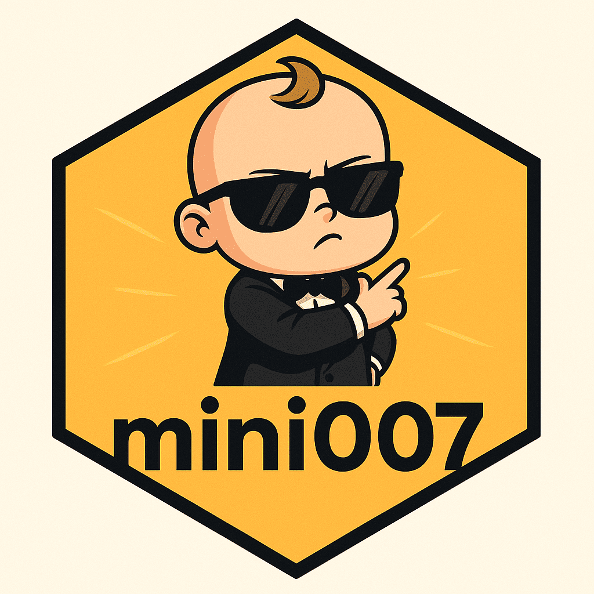

Mohamed El Fodil Ihaddaden recently (July 2025) shared mini007, a framework for creating LLM agents using R6 classes and ellmer. We can create multiple agent and assign each one a different task, these will then collaborate together under the supervision of a 'Lead Agent' to complete tasks such as finding information on a topic, summarizing, translating, and much more. Good to see more tools building on ellmer and using object classes for this kind of work.

### [LLMAgentR](https://knowusuboaky.github.io/LLMAgentR/)

<a href="https://cran.r-project.org/package=LLMAgentR"></a>

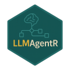

LLM agents are applications that can tackle relatively complex tasks by breaking them into 'sub-tasks' that can be addressed using tools and a flow of operations that leads to our desired response.

LLMAgentR by Kwadwo Daddy Nyame Owusu Boakye brings a state graph execution framework to R. This framework is inspired by the LangGraph and LangChain architectures and is used to define workflows as directed graphs where nodes represent functions and edges define how these are executed. These run in order and the framework lets developers build workflows with a more structured management of the intermediate steps (states) and a controlled execution flow.

LLMAgentR uses function from chatLLM to build agents for code generation, SQL queries, data cleaning, web research, forecasting, data visualization, and more.

The package has a lot of dependencies so be patient during installation. I tried out the data cleaning and the interpretation agents with good results, although these iterative workflows are very token-hungry and the free tiers for most providers may not be enough. Great overall addition to the LLM + R space!

## mlverse

### [mall](https://mlverse.github.io/mall/)

<a href="https://cran.r-project.org/package=mall"></a>


mall is part of the mlverse ecosystem of open source Data Science and Machine Learning libraries. Rather than a chat-based approach, mall applies LLMs rowwise in the columns of a data frame. Built-in prompts include translating, summarizing, extraction, and sentiment analysis of text strings.

mall uses Ollama and is implemented for both R and Python. I will likely be using it to analyze the comments I collected about loaded packages, which I talked about in my posit::conf(2024) talk.

### [lang](https://mlverse.github.io/lang/)


lang is also part of the mlverse. This package uses LLMs to translate R documentation and display it in the help pane of Rstudio or Positron. Having participated in various translation initiatives, I am very wary of machine-translated function documentation and how it may affect new learners.

The best part of this package (in my opinion) is the infrastructure for package developers to help translate documentation that after editing can be shipped as part of package with multilingual help files.

### [chattr](https://mlverse.github.io/chattr/)

<a href="https://cran.r-project.org/package=chattr"></a>


chattr is also part of the mlverse. This package interfaces LLMs with R directly inside RStudio. Interaction with the models ideally happens through a Shiny app that runs inside the Viewer pane in RStudio.

## Model Context Protocol (MCP) tools

### [mcptools](https://posit-dev.github.io/mcptools/)

<a href="https://cran.r-project.org/package=mcptools"></a>


> mcptools used to be called acquaint

mcptools by Simon Couch, Charlie Gao, and Winston Chang (plus other contributors) lets MCP-enabled tools like Claude Desktop, Lutra, Glama, and Claude Code connect directly to our R sessions. MCP is an open protocol to connect AI models to different tools and data sources in a standardized way (the MCP website calls the protocol the USB-C port of AI applications). In this setup the models can see our installed packages, environment, and session info so they will generate better-informed code, powered by btw to provide context. Potential game changer.

### [mcpr](https://mcpr.opifex.org/)


mcpr by John Coene from Opifex is an R implementation of the Model Context Protocol (MCP), letting applications written in R to interact with LLMs through a standard JSON-RPC 2.0 interface. We can build custom tools, and ultimately integrate them with Cursor, Claude Code, and VS Code Agent Mode. More importantly, MCPR tools build with the package can be converted to ellmer tools and registered with an ellmer chat session. Although MCP in general may have a steep learning curve mcpr is a huge contribution to R and a game-changing addition to this space.

### [ClaudeR](https://github.com/IMNMV/ClaudeR)


ClaudeR by Nykko Vitali provides an MCP integration so that Claude Desktop can execute code interactively in an active RStudio instance. Very nice example of MCP, with a safe bidirectional connection between Claude and RStudio that lets us work alongside the LLM or direct it to do tasks autonomously, and we can see the results in real time.

This [video](https://youtu.be/KSKcuxRSZDY?si=4c0R5rHnD84yWLv_) includes a nice and short demonstration of Claude (3.7 Sonnet) running through a set of instructions to do data analysis and visualization autonomously inside the running RStudio instance.

Thanks to MCP this package should also work with Cursor, or other services that allow for MCP servers and can run RStudio.

## ellmer and friends

<a href="https://cran.r-project.org/package=ellmer"></a>


> note that ellmer was previously called elmer, and was renamed in December 2024 to avoid case-insensitive clash with ELMER on bioconductor.

ellmer is a new tidyverse-adjacent package by Hadley Wickham and Joe Cheng for interacting in R with various models, either programmatically or interactively. elmer creates R6 chat objects that remember context, and we can interact with models with a console or browser-based chat box, or programmatically within R functions.

Seems promising, quite flexible, and all the activity in the GitHub repo suggests a very active development process, a solid dev team, and lots of community input.

### [kbretrieveR](https://github.com/MDRCNY/kbretrieveR)


kbretrieveR by Lazaro Alvarez is a package for retrieving relevant chunks from an AWS Bedrock Knowledge Base, which are a way to provide propietary or private contextual information to foundation models. kbretrieveR then merges this context into the prompt passed to our preferred chat client (e.g., `ellmer::chat_aws_bedrock()`). The package is work in progress but it seems super promising, and I was fortunate to meet up with Lazaro at posit::conf and chat about some very cool ideas he has for this topic.

### [contextR](https://github.com/lazasaurus-ai/contextR)

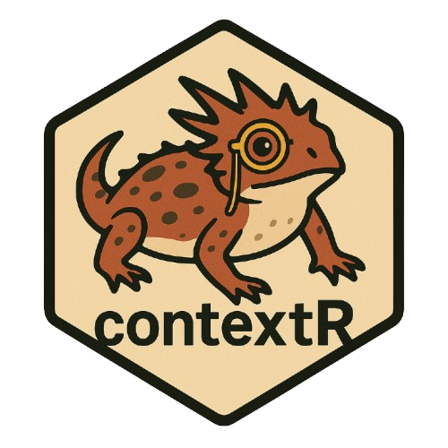

contextR by Lazaro Alvarez is a lightweight approach to implement conversational memory for R. Similar to LangChain's memory module for maintaining a persisting state between calls. The memory buffer can also be reused to carry over the accumulation of context. High potential for this package and the logo is 10/10.

### [btw](https://posit-dev.github.io/btw/)


As per the official documentation, btw helps us describe our computational environment to LLMs. This means we can give ellmer chat objects the ability to examine package documentation, objects in the R environment, and the contents of our working directory. btw is actively developed by Garrick Aden-Buie, Simon Couch, and Joe Cheng, so expect good things from the package. btw can be used interactively to parse objects or docs and have these as text in the clipboard, or as a way to equip LLM chats with this power automatically. Good companion for ellmer.

### [buggy](https://simonpcouch.github.io/buggy/)


buggy by Simon P. Couch uses LLMs to help R users understand and address error messages. With the tool properly set up and enabled, whenever we raise an error the package will give us clickable links to “explain” or “fix” the issue. Explanations are shown in the console, fixes are implemented directly. Also powered by btw to supply context to the model about the files and functions involved.

### ~~hellmer~~

> hellmer was removed from CRAN at the developer's request, and the GitHub repo no longer exists. Batch functionality now works well in ellmer so this may explain the removal. I've left this here for record-keeping.

*To batch process ellmer chats and their outputs, Dylan Pieper created hellmer. The package is loaded with useful features, has progress bars and helpful messages, and plays nicely with ellmer.*

### [chores](https://simonpcouch.github.io/chores/)

<a href="https://cran.r-project.org/package=chores"></a>


> chores was prevously called pal but was renamed recently. See this [issue](https://github.com/simonpcouch/chores/issues/83) for the discussion and reasoning behind the name change.

chores by Simon Couch provides easy to use assistants that can edit, document, or explain code. The package provides an addin that works in both RStudio and Positron. Very cute package logo, and pal seems like a good option for writing boilerplate code and automating some of the more tedious, repetitive tasks. Works with multiple underlying models. Haven't tried it yet.

-   Here's a [tutorial](https://bastianolea.rbind.io/blog/pal_asistentes_llm/) in Spanish for using chores with custom assistants that can have different roles.

### [ggpal2](https://github.com/frankiethull/ggpal2)


ggpal2 is an extension package for `chores` developed by Frank Hull. ggpal2 provides an LLM-powered assistant prompt-engineered specifically for working with `ggplot2`. Like chores and gander, we highlight code or text and through an addin and customizable shortcut: we can swap base R code with ggplot2, create a plot from a comment, or get suggestions for accesibility and readability for existing ggplot2 code.

A nice example of extending chores and leveraging ellmer through a set of well written prompts.

### [gander](https://github.com/simonpcouch/gander/)

<a href="https://cran.r-project.org/package=gander"></a>


Simon Couch is on a roll, and released the cool gander package in early 2025.

gander leverages ellmer to go beyond a chat box and actually incorporate a context-aware assisant into our IDE of choice. Works well in both RStudio and Positron, and can actually look for context in files and inside R environment (variable names, objects, function definitions, etc.)

This short screen recording comes from the package readme and shows the tool in action:

<figure><a href="https://github.com/user-attachments/assets/4aead453-c2f2-446b-8e81-9154fd3baab0"></a></figure>

This feels similar to using the cContinue extension in Positron but more oriented to R, and I'll likely be using this going forward.

gander now has an [official introduction](https://posit.co/blog/introducing-gander/) on the Posit Blog (published 17/03/2025).

### [statlingua](https://bgreenwell.github.io/statlingua/)

<a href="https://cran.r-project.org/package=statlingua"></a>

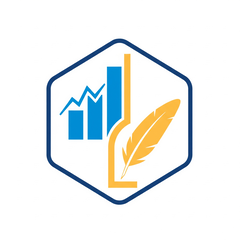

statlingua by Brandon M. Greenwell is another cool package that leverages ellmer and is essentially a prompt engineering toolkit to explain statistical outputs in plain language using LLMs and context about our analyses. Supports most model objects (e.g., `lm()`, `glm()`,`lmer()`,`gam()`,`survreg()`,`rpart()`) and the package is designed to be extensible to other model objects. The code looks robust and the package is very well documented.

## Shiny integrations

### [shinychat](https://posit-dev.github.io/shinychat/r/index.html)

<a href="https://cran.r-project.org/package=shinychat"></a>

shinychat from the posit Shiny team provides easy-to-use UI components to add LLM-powered chats to our Shiny apps. Works for R and Python and supports multiple model providers. shinychat uses ellmer and the model responses stream smoothly into the chat.

### [querychat](https://posit-dev.github.io/querychat/r/index.html)

querychat is also developed by the Shiny team at posit, and this package gives us a drop-in chat component for Shiny apps that uses LLMs to query data frames using natural language. The coolest thing about querychat is that the chosen model is not given access to the data beyond variable names and overall structure. Instead, querychat has the models build SQL queries (which we can see if we want), which then run on our system and then we get our desired outputs. This was demoed extensively at posit::conf 2025 and also looks very promising.

## RAG tools

### [ragnar](https://tidyverse.github.io/ragnar/)

<a href="https://cran.r-project.org/package=ragnar"></a>


As the name implies, ragnar by Tomasz Kalinowski helps implement Retrieval-Augmented Generation (RAG) workflows in R with transparency and efficiency. Uses duckdb by default for efficient work with big data and provides acces to embedings from ollama and openAI models (openAI model support is new and more models likely to come soon). RAG is a way to link generative models with external resources rich in technical details to ultimately enhance the accuracy and reliability of models with real, citable facts.

**ragnar was recently moved into the tidyverse organization on GitHub so I assume big things are coming.**

I liked the example in the readme, showing how the **R for Data Science** book was ingested and queried using the package.

### [rdocdump](https://www.ekotov.pro/rdocdump/)

<a href="https://cran.r-project.org/package=rdocdump"></a>


rdocdump by Egor Kotov helps us dump the source code, documentation and vignettes of an R package into a single plain text file or character string for downstream use in RAG workflows. Works with installed packages or zipped archives (tar.gz), and downloads source code from CRAN if a package is not installed. Similar to pkgprompt.

### [pkgprompt](https://github.com/simonpcouch/pkgprompt)

I'm listing pkgprompt by Simon Couch under the RAG heading here because the package is meant to convert R package documentation into plain text that can be ingested by an LLM, as a prompt or as part of a RAG workflow. Can convert all the documentation for a package or just particular topics with a `topics` argument.

## Computer Vision

### [kuzco](https://github.com/frankiethull/kuzco)


kuzco by Frank Hull & Johannes Breuer leverages ollamar and ellmer to provide a computer vision assistant right inside R, using LLMs as an alternative to torch for tasks including image classification, recognition, sentiment, and text extraction. The output provided comes in very nice and usable tibbles.

Cool hex logo and the example in the readme features a very cute puppy :3

## Image generation

### [stableDiffusion4R](https://github.com/kumeS/stableDiffusion4R)

stableDiffusion4R by Satoshi Kume connects R with Stable Diffusion APIs for image generation and transformation tasks. We can use text-to-image, image upscaling, and image-to-image methods with this package. Uses OpenAI or DreamStudio APIs and the package has pre-built functions to do things like generate or images using Stable Diffusion or DALL.E.2, create prompts meant for image generation, and even create hex logos.

### [diffuseR](https://github.com/cornball-ai/diffuseR)


diffuseR by Troy Hernandez is an R implementation of diffusion models for image generation and manipulation using torch without any Python dependencies. Inspired by the `diffusers` Python library from Hugging Face. Currently supports Stable Diffusion 2.1 and Stable Diffusion XL (SDXL), and can create images from text descriptions or modify existing images based on text prompts. Quick warning here: the package needs an installation of torch, sufficient memory for loading model files, and preferably a GPU for the computationally intensive parts of the process. Very cool-looking example outputs in the package's Readme page.

## Transformer model applications

### [LLMing](https://github.com/sliplr19/LLMing)

<a href="https://cran.r-project.org/package=LLMing"></a>

LLMing (lemming) by Lindley Slipetz and Teague Henry is a compact package for psychological text analysis. Uses BERT embeddings and currently includes functions for text generation and text anomaly detection. 

### [text](https://www.r-text.org/)

<a href="https://cran.r-project.org/package=text"></a>

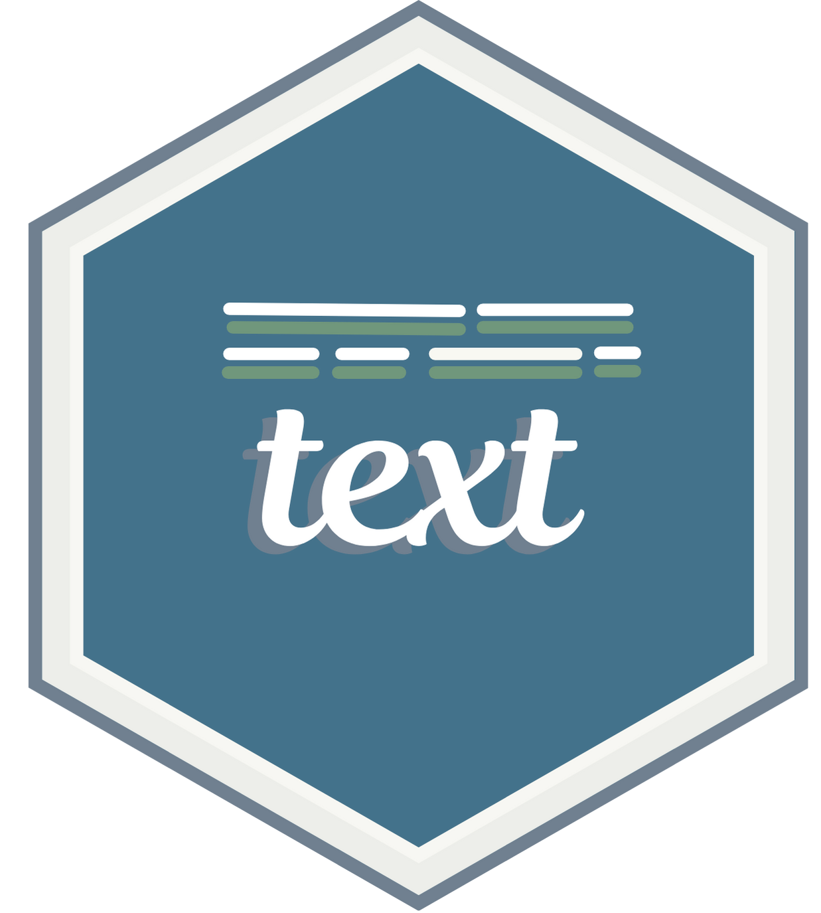

text by Oscar Kjell, Salvatore Giorgi, and Andrew Schwartz uses transformed-based models to analyze natural language. The text package gives us access to models from Hugging Face so we can transform text to word embeddings and use them in other tasks, including RAG. A great tool for NLP work that can also help LLM users in general understand word embeddings better.

text, along with talk and topics (see below) is part of the *R Language Analysis Suite*, a set of three related packages developed for working with transformers and natural langauge.

### [talk](https://www.r-talk.org/)


talk by Oscar Kjell, Adithya Ganesan, Rajath Rao, and Akshay Raghavan is similar to text, but it can transcribe audio to text and also create embeddings from voice recordings. Uses Hugging Face transformers by installing relevant Python packages in a conda environment.

### [topics](https://www.r-topics.org/)

<a href="https://cran.r-project.org/package=topics"></a>

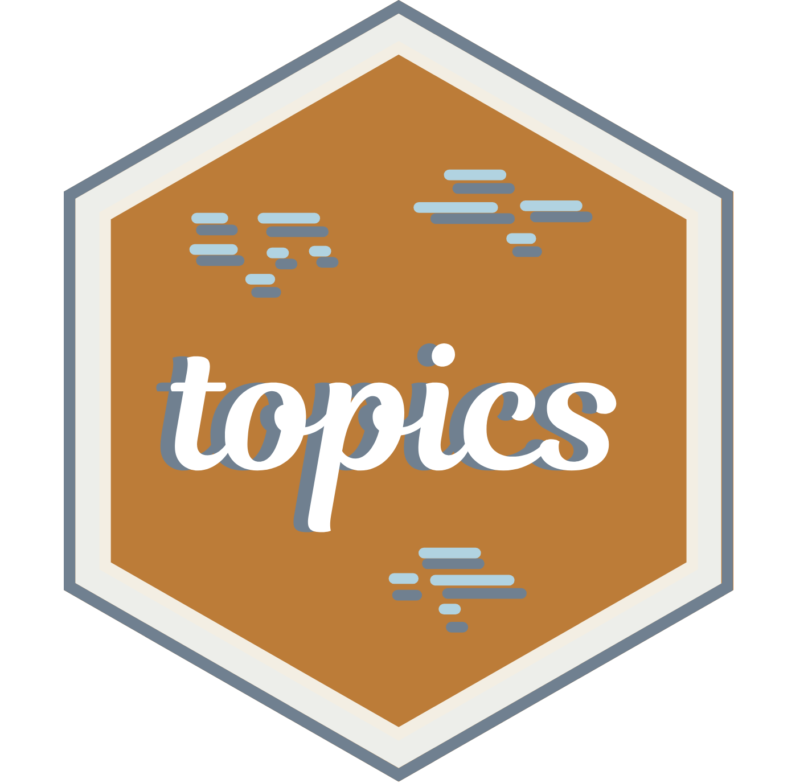

topics by Leon Ackermann, Zhuojun Gu, and Oscar Kjell implements Differential Language Analysis. This is not necessarily an LLM-based tool but we can use topics to visualize language patterns. Needs java.

### [pangoling](https://docs.ropensci.org/pangoling/index.html)

<a href="https://cran.r-project.org/package=pangoling"></a>


pangoling by Bruno Nicenboim, Chris Emmerly, and Giovanni Cassani is an R package for estimating the predictability of words in a given context using transformer models (e.g. GPT-2 or BERT). These word probabilities are often used as predictors in psycholinguistic studies.

Very nice to see a robust rOpenSci package for this topic. The package is mostly a wrapper of the python package transformers to process data.

## Web searches from R

### [webretrieveR](https://github.com/lazasaurus-ai/webretrieveR )
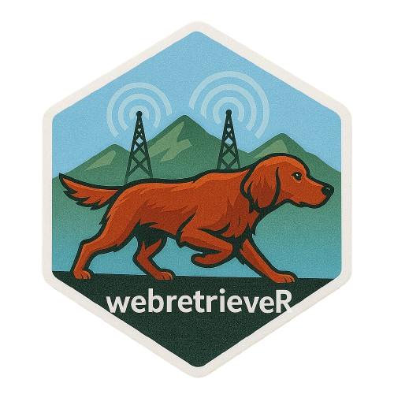

webretrieveR by Lázaro Álvarez brings a lightweight and streamlined interface for retrieving information from web sources directly in R for use in LLM workflows. Supports queries on DuckDuckGo (prioritizing Instant Answers when available) and Wikipedia, returning clean, structured text that can we can use downstream, including piping this new context into ellmer workflows, thanks to the good integration with the ellmer ecosystem. WebretrieveR ultimately lets us augment prompts with real-time or reference-based context for more accurate and relevant results. The package should get better with time, and there are plans for adding to support for searching  Brave, PubMed, arXiv, Bing and CRAN.

### [searcher](https://r-pkg.thecoatlessprofessor.com/searcher/)

<a href="https://cran.r-project.org/package=searcher"></a>


searcher is package specifically focused on letting us search the web directly from R. Developed by James Balamuta, searcher has functions to perform searches using different search engines, but the package also comes with tools for integration with AI assistants. We can ask questions or send prompts to various models providers, and the functions will launch a web browser ready to answer. For example: `ask_mistral("How to handle missing data in R?")` or `ask_claude("Explain what purrr::map_df does")`.
